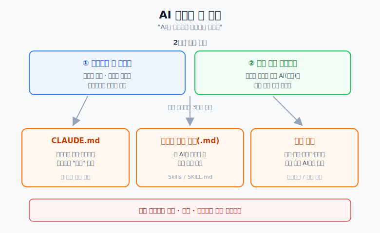
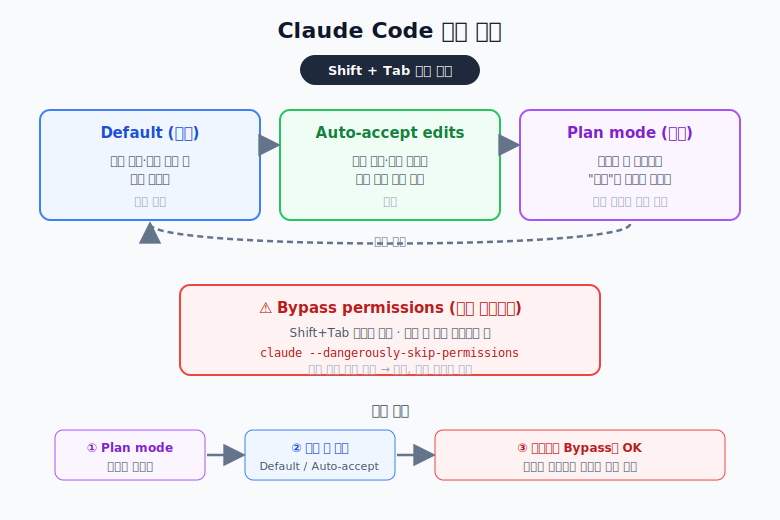
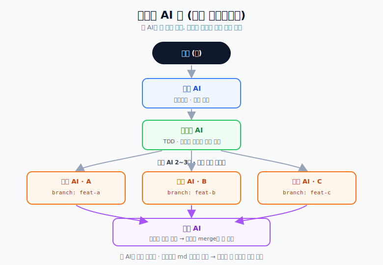

# AI로 사이드 프로젝트 진행하기

> AI(Claude Code 등)를 활용해 사이드 프로젝트를 진행하는 나만의 방법론 정리.
> 핵심 한 줄: **"AI를 잘 부려먹으려면, AI를 신입사원 채용하듯 대해야 한다."**

---

## 0. 큰 그림

AI 코딩을 잘하는 핵심은 두 가지다.

1. **AI가 제멋대로 이상하게 고치지 않게** — 정해진 범위, 정해진 기능만 건드리도록 규칙을 준다.
2. **한 명이 다 하는 게 아니라 여러 명이 협업하듯** — 역할을 나눠서 여러 AI(세션)가 각자 맡은 일만 하도록 한다.

이걸 실현하는 도구가 아래 세 가지다.

- **CLAUDE.md** : 프로젝트의 규칙·컨벤션을 적어두는 "사규(社規)" 문서
- **역할별 규칙 문서(.md)** : 각 AI가 지켜야 할 코딩 규칙 모음
- **역할 분리(에이전트/세션 분리)** : 기획·개발·테스트·리뷰를 서로 다른 AI에게 맡김



> 결론부터: 코딩 실력보다 **기획·계획·문서화가 훨씬 중요**하다. 문제 정의를 잘하고 규칙을 잘 적어두면 나머지는 AI가 빠르게 만든다.

---

## 1. AI를 "신입사원 채용"이라고 생각하기

신입에게 일을 시키듯, AI에게도 **명확한 지시와 규칙**을 줘야 한다.

### 프롬프트에 꼭 넣어야 하는 말

AI가 문서를 대충 읽고 넘어가지 않도록, 아래 같은 표현을 명시적으로 쓴다.

```text
아래 md 문서들이 어떻게 동작하는지 깊이 이해하고, 모든 세부사항을 파악해라.
규칙에 맞게 상세히 읽고, 모든 세부 규칙을 지키면서 작업해라.
```

이런 "꼼꼼히 읽어라"는 지시를 넣는 것과 안 넣는 것의 결과 차이가 크다.

### 준비해야 할 문서들

| 문서 | 역할 |
|------|------|
| `CLAUDE.md` | 프로젝트 전체 규칙·기술스택·구조 (항상 로드됨) |
| `역할 인식.md` | 각 AI가 자기 역할을 인지하도록 하는 문서 |
| `기획.md` | 상세 설명, 코드 스니펫, 요구사항 등 |
| `기능별.md` | 기능 단위 명세 |
| `코딩규칙-1,2,3.md` | 세부 코딩 규칙 |

> ⚠️ **주의:** md 문서를 내 마음대로 아무렇게나 수정하면 AI가 이상하게 동작한다.
> 수정할 때는 **주석을 달아서** AI가 "여기는 참고/변경 가능한 부분"임을 알 수 있게 한다.

---

## 2. Claude Code 실전 사용법

### 설치

- Claude Code를 설치한다. VS Code나 IntelliJ 안에서도 실행할 수 있다.

### 작업(권한) 모드

Claude Code는 `Shift + Tab`으로 **아래 3개 모드를 순환**하며 바꾼다.
(❗ 아래 이름은 실제 공식 명칭으로 정리한 것 — 예전에 대충 알던 이름과 다를 수 있음)

| 모드 | 실제 명칭 | 동작 |
|------|-----------|------|
| 기본 | **Default** | 파일 수정·명령 실행 전에 매번 물어봄 |
| 자동 수정 수락 | **Auto-accept edits** | 파일 수정·기본 명령을 묻지 않고 바로 실행 |
| 계획 | **Plan mode** | 소스는 안 건드리고 "계획"만 세워서 보여줌 |

여기에 더해, **권한 건너뛰기(Bypass permissions)** 모드가 따로 있다. 이건 `Shift + Tab` 순환에는
포함되지 않고, Claude Code를 실행할 때 별도 플래그(`claude --dangerously-skip-permissions`)로 켠다.
확인 없이 전부 실행하므로 **위험**하다. 정말 신뢰할 때만 쓴다.

### 추천 흐름

```text
1) Plan mode 로 계획을 완벽하게 짠다
2) 계획을 검토한 뒤 Default(물어봄) 또는 Auto-accept edits 로 전환해 코딩
3) 계획이 완벽하고 위험이 적으면 Bypass permissions 도 OK
```



> 핵심: **먼저 계획을 세우고(플랜) → 그 다음에 실제 코딩**. 바로 코딩부터 시키지 않는다.

---

## 3. CLAUDE.md 잘 만들기

`CLAUDE.md`는 **프로젝트의 살아있는 기억**이다. 매 세션마다 자동으로 읽히기 때문에, 여기에 규칙을 잘 적어두면 AI가 매번 지킨다.

들어가야 할 내용 예시:

- **워크플로우 / 에이전트 / 사용할 툴** 정의
- **에러 대응 규칙** — 에러가 나면 스스로 분석하고 고치고 학습하도록
  ```text
  에러 발생 → 원인 분석 → 코드 수정 → 재테스트 → 문서 업데이트
  ```
- **보안 설정 (필수)**
  - API 키는 반드시 `.env` 에 (코드에 하드코딩 금지)
  - `.gitignore` 에 `.env` 포함 확인
  - 배포 전 보안 리뷰

> `CLAUDE.md`를 놓는 위치: 프로젝트 루트(`./CLAUDE.md`), `./.claude/CLAUDE.md`, 또는 사용자 전역(`~/.claude/CLAUDE.md`) 등에 둘 수 있다.

---

## 4. AI에게 역할 부여하기 (핵심)

한 AI가 기획·개발·테스트를 전부 하게 하지 말고, **역할별로 나눠서** 맡긴다. 실제 개발팀처럼.

### 역할 예시

- **기획 AI** : 요구사항·설계 정리
- **테스터 AI** : TDD로 기능별 테스트 코드를 먼저 작성
- **개발 AI (2~3명)** : 각자 독립적으로 기능 구현
- **리뷰 AI** : 결과물을 검증하고 최선을 선택



각 AI는 **자기 역할만** 충실히 한다. 마음대로 다른 일 하지 않는다.

### 역할을 나누는 실제 방법 = "세션(브랜치)을 나누는 것"

- 개발자 두 명이 같은 기능을 각자 개발한다면 **브랜치를 따로** 만든다.
- 기능을 추가할 때마다 **md 문서로 상세히 정리**하게 한다.
  → 간단한 내용은 md 문서만 보고 파악하고, 꼭 필요할 때만 코드를 본다.
- 비교할 때는 각자 작업한 결과를 놓고 **테스트를 돌려본 뒤**, 팀장(나)이 merge할 것을 선택한다.
- 프롬프트할 때 **자기 역할을 인지하도록** 계속 상기시킨다.

> 📌 참고: Claude Code의 **서브에이전트**는 기본적으로 한 세션 안에서 **순차적으로** 동작한다.
> 여러 AI를 **진짜 동시에(병렬)** 돌리려면 **에이전트 팀(Agent Teams)** 기능이 필요하다.
> → 이 방식을 정식으로 구성하는 방법은 [Spring Harness 적용 가이드](./spring-harness-guide.html) 참고.

---

## 5. 코딩보다 중요한 것 = 기획·계획

- **PRD(제품 요구사항 문서)를 잘 만든다.**
- **문제 정의**를 잘하고, **어떻게 해결할지**를 문서화한다.
- 문제 정의와 해결 방법만 명확하면, 단순 기능 개발은 AI와 함께 정말 빠르게 만들 수 있다.
- 항상 **MVP(최소 기능 제품)** 로 시작한다.
  - 기능은 최소한으로. (로그인·인증 등은 생각보다 무거운 기능이니 처음부터 넣지 말 것)

---

## 6. 기술 규칙 문서들 (개발 AI가 지킬 코딩 규칙)

> 규칙이 너무 많아서 md 문서 하나에 다 담기는 어렵다. 성격별로 나눠서 관리한다.
> (Claude Code의 **Skills / SKILL.md** 기능이 이런 규칙 묶음을 관리하는 데 쓰인다.)

정리해둘 규칙 예시:

- **JPA / QueryDSL 규칙**
  - 동적 변환이 아니면, 타입은 무조건 `ENUM = DB의 String` 으로. 관련 기능도 Enum 안에서 구현.
  - JPA 커스텀 impl 대신 어떻게 처리할지
  - DTO로 반환할지 / Entity로 반환할지 기준
- **React, REST API** 규칙
- **예외(Exception) 처리** 규칙
- **util / MVC 패턴** (Service·Controller 분리)
- **JWT / Security** 적용 규칙
- **`.gitignore`, `.env`** 관리
- **프로젝트 구조** (Spring Boot, DB, 로컬 ↔ 운영 환경 분리 등)

> 이 문서들은 **모든 프로젝트 공통**인 것과 **이 프로젝트 전용**인 것을 분리해서 관리한다.

---

## 7. 앱 개발 후기에 담을 것

앱을 만들고 나면 아래 관점으로 회고를 남긴다.

- 어떤 앱인가 / 왜 만들었나 / 어떻게 만들었나 / 누가 쓸 것인가

느낀 점:

- AI에게만 의존하지 말고 **어느 정도는 내가 직접 코딩할 줄 알아야** 한다.
- 문제를 내가 직접 찾아야 하는 경우도 있으니, Dart 등으로 직접 앱을 만들어보는 경험도 필요하다.

---

## 8. 지금의 목표

- 이 방법론을 우선 정리해두고, **실제 프로젝트에 하나씩 적용하며** 다듬어 간다.
- 당장의 목표: **`businesscard_qr` 프로젝트를 끝내는 것.**
  - 백엔드는 Supabase만으로도 가능하지만, **연습 삼아 Railway 배포**까지 해본다.

---

### 관련 문서
- [Spring 프로젝트 Harness 적용 가이드](./spring-harness-guide.html) — 역할별 AI 팀을 실제로 구성하는 구체적 방법
