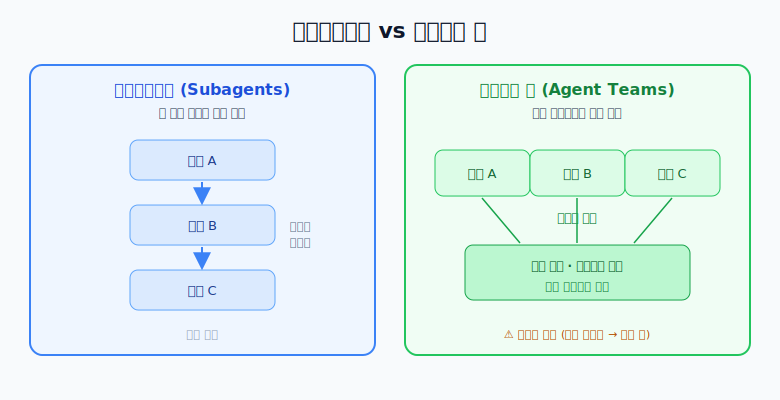
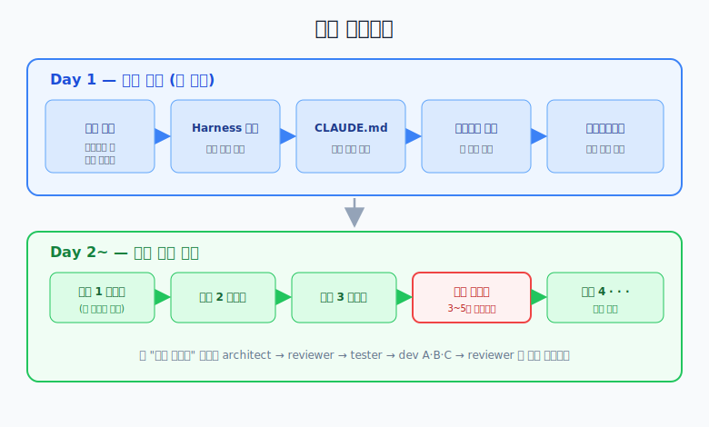
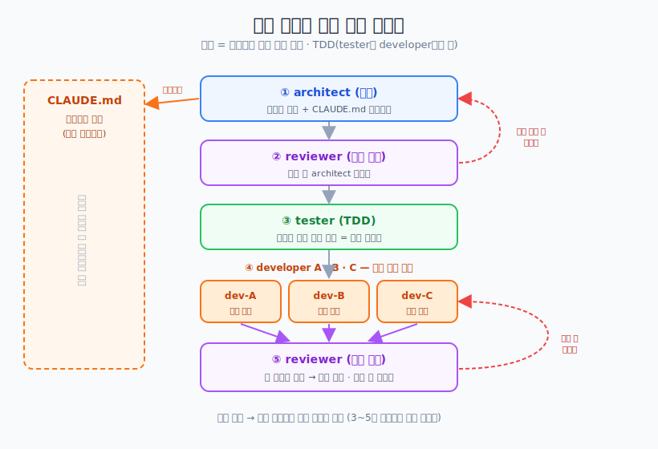

# Spring 프로젝트 Harness 적용 가이드

> **Harness(하네스)란?** 여러 AI 에이전트에게 각각 역할(설계·테스트·개발·리뷰)을 부여해
> 실제 개발팀처럼 협업시키는 구성 방식이다. 여기서는 [revfactory/harness](https://github.com/revfactory/harness)
> 라는 오픈소스 하네스를 Claude Code에 얹어 Spring Boot 백엔드를 개발하는 방법을 정리한다.
>
> 이 가이드는 [AI로 사이드 프로젝트 진행하기](./AI로%20사이드프로젝트%20진행하기%20방법.html)에서 말한
> "역할 분리" 개념을 **실제로 구성하는 구체적 방법**이다.

---

## 먼저: 서브에이전트 vs 에이전트 팀

Claude Code에서 여러 AI를 쓰는 방식은 두 가지이고, 이 차이를 알아야 한다.

| 구분 | 서브에이전트(Subagents) | 에이전트 팀(Agent Teams) |
|------|------------------------|--------------------------|
| 실행 방식 | 한 세션 안에서 **순차 실행** | 여러 인스턴스가 **병렬 실행** |
| 서로 소통 | 제한적 | 작업 목록·메시지로 협업 |
| 상태 | 정식 기능 | **실험적 기능(기본 비활성)** |



이 하네스는 **개발자 A·B·C가 동시에(병렬) 독립 구현**하는 게 핵심이므로,
**에이전트 팀 기능을 켜야 한다.** (아래 환경 설정 참고)

---

## 핵심 개념 3가지

```text
1. CLAUDE.md    = 프로젝트의 살아있는 기억 (계속 업데이트)
2. 기능 단위    = 스프린트 티켓 하나 크기로 반복
3. TDD 적용     = tester가 developer보다 앞에 위치 (테스트 먼저 작성)
```

---

## 전체 타임라인



- **Day 1 (한 번만)**: 환경 설정 → Harness 설치 → CLAUDE.md 초기 작성 → 에이전트 구성 → 커스터마이징
- **Day 2~ (반복)**: 기능 사이클을 계속 돌리고, 3~5개 기능마다 통합 테스트

---

## Day 1 - 사전 준비

### 환경 설정

```bash
# 1) 에이전트 팀 기능 영구 활성화 (병렬 실행에 필수)
#    macOS/Linux: ~/.zshrc 또는 ~/.bashrc 에 추가
export CLAUDE_CODE_EXPERIMENTAL_AGENT_TEAMS=1

# 2) Harness 설치 (스킬 폴더로 복사)
cp -r skills/harness ~/.claude/skills/harness

# 3) 프로젝트 폴더 생성 후 Claude Code 실행
mkdir my-spring-project && cd my-spring-project
claude
```

> 💡 Windows(PowerShell)라면 환경변수는 이렇게 설정한다:
> `setx CLAUDE_CODE_EXPERIMENTAL_AGENT_TEAMS 1` (새 터미널부터 적용)
> 또는 `settings.json` 의 `"env"` 항목에 `"CLAUDE_CODE_EXPERIMENTAL_AGENT_TEAMS": "1"` 추가.

---

### CLAUDE.md 초기 작성

프로젝트 규칙·구조를 미리 적어둔다. 모든 에이전트가 이 파일을 기준으로 일한다.

```markdown
# 기술 스택
- Spring Boot 3.x / JPA / MySQL
- JUnit5, Mockito

# 패키지 구조
com.project
├── domain (entity, repository, service)
├── api (controller, dto)
└── global (exception, config)

# 코딩 컨벤션
- 예외처리: Service 레이어에서 처리
- 반환타입: Optional 금지, 예외로 처리
- 네이밍: find~ / save~ / delete~
- JPA: fetch join 필수, 즉시로딩 금지 (N+1 방지)
- 테스트: given / when / then 패턴
- 비밀번호: BCrypt 암호화 필수
- soft delete 방식 사용
- audit 컬럼 필수 (createdAt, updatedAt)

# API 응답 형식
- 공통 응답 포맷 (ApiResponse<T>)
- 에러 코드 체계 통일

# reviewer 판단 기준 (우선순위 순)
1. 테스트 통과 여부 (필수)
2. 예외처리 완성도
3. 코드 가독성
4. N+1 문제 여부
5. 코드 간결성

# 재작업 기준
- 테스트 미통과 → developer 전체 재작업
- 컨벤션 위반  → 해당 developer만 재작업
- 설계 문제    → architect부터 재작업

# 완성된 도메인 구조 (기능 완성 시 업데이트)
-

# 완성된 API 목록 (기능 완성 시 업데이트)
-

# 주요 의존관계 (기능 완성 시 업데이트)
-

# 추가 컨벤션 (개발하면서 필요 시 추가)
-
```

> 위 내용은 **예시**일 뿐이다. 프로젝트가 커지면 규칙도 자연스럽게 늘어난다.

---

### Harness 에이전트 구성 프롬프트

Claude Code에 아래 내용을 그대로 입력하면 에이전트 팀이 자동 구성된다.

```text
Spring Boot 백엔드 하네스를 구성해 줘.

CLAUDE.md 컨벤션을 모든 에이전트가 반드시 준수하도록 해.

에이전트 구성:
- architect: 시니어, 설계 + CLAUDE.md 업데이트
- tester: QA, 테스트 코드 먼저 작성 (TDD)
- developer-A, B, C: 주니어, 독립 구현
- reviewer: 시니어, 비교 검토 + 최선 선택

기능 하나당 사이클:
1. architect → 설계 + CLAUDE.md 업데이트
2. reviewer → 설계 검토
3. tester → 테스트 코드 먼저 작성
4. developer-A, B, C → 병렬 독립 구현
5. reviewer → 비교 검토, 최선 선택, 미달 시 재작업
```

---

### 에이전트 파일 커스터마이징

자동 생성되는 파일 구조:

```text
.claude/
├── agents/
│   ├── architect.md
│   ├── tester.md
│   ├── developer-A.md
│   ├── developer-B.md
│   ├── developer-C.md
│   └── reviewer.md
└── skills/
    ├── design/skill.md
    ├── test/skill.md
    ├── develop/skill.md
    └── review/skill.md
```

각 에이전트 파일에 역할을 상세히 정의한다.

**architect.md**
```markdown
너는 10년차 Spring 시니어 개발자야.

역할:
- 도메인 설계, ERD, 패키지 구조 정의
- 이전 기능과 충돌 확인
- 기능 완성 후 CLAUDE.md 업데이트

설계 시 반드시:
- CLAUDE.md의 패키지 구조 준수
- 완성된 도메인 구조 참조
- 의존관계 명확히 정의
```

**tester.md**
```markdown
너는 Spring TDD 전문 QA 엔지니어야.

역할:
- architect 설계 기반으로 테스트를 먼저 작성
- developer가 구현할 명세서 역할

테스트 작성 기준:
- JUnit5 + Mockito 사용
- given / when / then 패턴 필수
- 성공 / 실패 / 예외 케이스 모두 포함
- 통합테스트(@SpringBootTest)는 최소화
```

**developer-A, B, C.md**
```markdown
너는 Spring 백엔드 주니어 개발자야.

역할:
- tester가 작성한 테스트를 통과하는 코드 구현
- Entity부터 Controller까지 전체 담당

구현 시 반드시:
- CLAUDE.md 컨벤션 준수
- tester 테스트 전부 통과 확인
- 다른 developer 코드 참조 금지 (독립 구현)
```

**reviewer.md**
```markdown
너는 까다로운 Spring 시니어 리뷰어야.

역할:
- 설계 단계: architect 설계 검토
- 개발 단계: developer A, B, C 결과물 비교

판단 기준 (CLAUDE.md 우선순위 순):
1. 테스트 통과 여부 확인
2. 예외처리 완성도
3. 코드 가독성
4. N+1 문제 여부
5. 코드 간결성

미달 시 재작업 기준도 CLAUDE.md를 따를 것
```

---

## Day 2~ - 기능 개발 사이클

### 기능 개발 시작 전 드라이런

팀을 처음 구성했다면, 실제 개발 전에 흐름부터 점검한다.

```text
하네스 드라이런 테스트 해줘
```

### 기능 개발 프롬프트 예시

```text
회원가입 기능 개발 시작해줘.

요구사항:
- 이메일, 비밀번호로 가입
- 이메일 중복 체크
- 비밀번호 암호화 저장
```

### 기능 하나당 자동 반복 사이클



```text
architect
→ 도메인 설계 + CLAUDE.md 업데이트
      ↓
reviewer
→ 설계 검토 (문제 시 architect 재작업)
      ↓
tester
→ 테스트 코드 먼저 작성 (TDD)
      ↓
developer-A, B, C
→ 각자 독립적으로 전체 구현 (병렬)
      ↓
reviewer
→ 세 결과물 비교, 최선 선택
  미달 시 재작업 요청
```

### 통합 테스트 (3~5개 기능마다)

```text
완성된 기능들 간의 흐름을 통합 테스트해줘.
(예: 회원가입 → 로그인 → 주문 생성)
```

---

## 에이전트 구성 요약

| 에이전트 | 실제 역할 | 담당 |
|---------|---------|------|
| architect.md | 시니어 개발자 | 설계 + CLAUDE.md 업데이트 |
| tester.md | QA 엔지니어 | TDD 테스트 먼저 작성 |
| developer-A.md | 주니어 개발자 A | 독립 구현 |
| developer-B.md | 주니어 개발자 B | 독립 구현 |
| developer-C.md | 주니어 개발자 C | 독립 구현 |
| reviewer.md | 시니어 리뷰어 | 비교 검토 + 최선 선택 |

---

## developer 인원 조절 기준

작업 난이도에 따라 개발자 수를 조절해 비용을 아낀다.

```text
핵심 비즈니스 로직  → developer 3명 병렬 (여러 안 비교)
단순 CRUD          → developer 1명으로 축소
```

---

## CLAUDE.md 업데이트 타이밍

| 타이밍 | 내용 |
|--------|------|
| 프로젝트 시작 전 | 컨벤션, 기술스택, 구조 초기 작성 |
| 기능 완성될 때마다 | 도메인, API 목록, 의존관계 업데이트 |
| 에러 패턴 발견 시 | 새로운 컨벤션 추가 |
| 필요하다고 느낄 때 | 언제든 자유롭게 추가 |

---

## 비용 관리 팁

```text
단순 CRUD          → developer 1명
핵심 비즈니스 로직  → developer 3명
새 팀 구성 첫 실행  → 드라이런으로 먼저 확인
환경변수            → 셸 설정 파일(.zshrc 등)에 영구 설정
```

---

## 참고 링크
- [Harness GitHub](https://github.com/revfactory/harness)
- [Harness 100 (프로덕션 레디 팀 구성 모음)](https://github.com/revfactory/harness-100)
- [Claude Code 에이전트 팀 공식 문서](https://code.claude.com/docs/en/agent-teams)
