# 정규화 정리

## 한눈에 구조 보기

```text
원본 테이블(중복/이상 존재)
        |
        v
1NF (원자값 보장)
        |
        v
2NF (부분 종속 제거)
        |
        v
3NF (이행 종속 제거)
        |
        v
BCNF (모든 결정자 = 후보키)
        |
        v
4NF (다치 종속 제거)
```

## 1NF - 원자값

- 각 컬럼은 원자값(atomic value)을 가져야 함
- 쉽게 말하면 한 컬럼에 여러 값이 들어가면 안 됨
- ❌ `roles: "ADMIN,USER,MANAGER"` → 1NF 위반
- ✅ `user_roles` 테이블로 분리 → 1NF 준수
- comma-separated로 저장하는 게 대표적인 1NF 위반 사례

## 2NF / 3NF - 종속 컬럼 분리

둘 다 핵심은 "종속된 컬럼을 따로 테이블로 분리"  
뭐에 종속됐냐의 차이만 있음

### 2NF → 복합키의 일부에 종속 (부분 종속 제거)

기본키: `(주문ID, 상품ID)`

- `(주문ID, 상품ID) → 수량` ✅ 복합키 전체에 종속 (문제 없음)
- `상품ID → 상품명` ❌ 복합키 일부에만 종속 (2NF 위반)

→ `상품(상품ID, 상품명)` 테이블로 분리

### 3NF → 일반 컬럼(비키 컬럼)에 종속 (이행 종속 제거)

`학생ID → 학과코드 → 학과명`

학과명이 기본키(학생ID)가 아닌  
일반 컬럼(학과코드)에 종속됨 → 3NF 위반

→ `학과(학과코드, 학과명)` 테이블로 분리

## 2NF, 3NF 왜 굳이 나눴냐?

실무에서는 구분 없이 "이 컬럼 여기 있는 게 맞나?" 감각으로 분리하면 자연스럽게 둘 다 달성됨  
나눈 건 순수하게 학문적으로 단계별 진단을 가능하게 하려고 쪼갠 것  
"이 테이블은 2NF지만 3NF는 아니다" 이런 식으로 잘못된 설계를 논리적으로 설명하고 설득하기 위한 도구

## BCNF - 3NF의 엄격한 버전

3NF와 비슷하지만 더 엄격함

- 모든 결정자는 반드시 후보키여야 함

기본키: `(학생번호, 과목)`

- `(학생번호, 과목) → 지도교수` ✅
- `지도교수 → 과목` ❌ 지도교수가 후보키가 아닌데 결정자 역할

→ BCNF 위반

3NF는 만족하는데 BCNF는 못 만족하는 케이스가 존재하기 때문에 별도로 정의됨

정규형 순서상으로는:  
`1NF → 2NF → 3NF → BCNF → 4NF → 5NF`

BCNF는 3NF와 4NF 사이라 3.5NF라고도 불림

## 4NF - 다치 종속

다치 종속(Multi-valued Dependency) 제거  
다치 종속이란 한 컬럼이 서로 독립적인 여러 컬럼에 다중값으로 종속되는 것

- `Person ↠ 자격증` (여러 자격증 보유 가능)
- `Person ↠ 언어` (여러 언어 사용 가능)

❌

| Person | 자격증 | 언어 |
| --- | --- | --- |
| 홍길동 | 정보처리기사 | Java |
| 홍길동 | 정보처리기사 | Python |
| 홍길동 | SQLD | Java |
| 홍길동 | SQLD | Python |

→ 자격증이랑 언어는 서로 무관한데 모든 조합을 다 써야 하는 문제 발생

✅ 분리

| Person-자격증 테이블 | Person-언어 테이블 |
| --- | --- |
| 홍길동 \| 정보처리기사 | 홍길동 \| Java |
| 홍길동 \| SQLD | 홍길동 \| Python |

## 근데 왜 4NF부터는 굳이 안 하냐?

개발자-자격증-언어 이렇게 있으면 같은 테이블에 있는 게 오히려 자연스럽고 편함

분리했을 때 단점:

- JOIN이 늘어나서 조회가 복잡해짐
- 얻는 정합성 이득보다 복잡도 손해가 더 큼

정규화는 높을수록 좋은 게 아니라 상황에 맞게 하는 것:

| 단계 | 실무 적용 |
| --- | --- |
| 1NF ~ BCNF | 거의 필수 |
| 4NF 이상 | 특수한 경우 아니면 굳이 안 함 |


## 슬라이드 보기
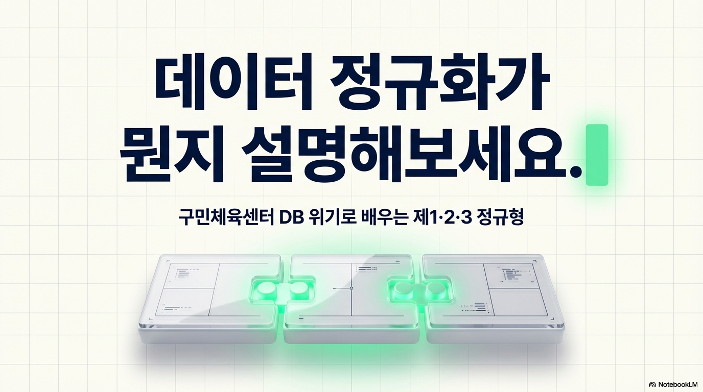
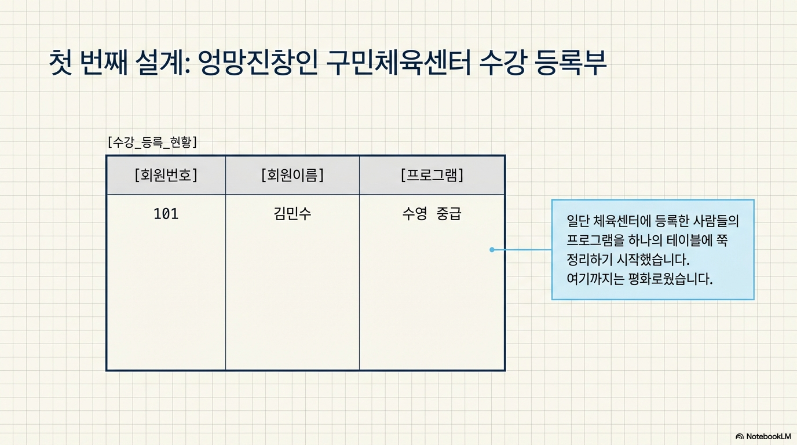

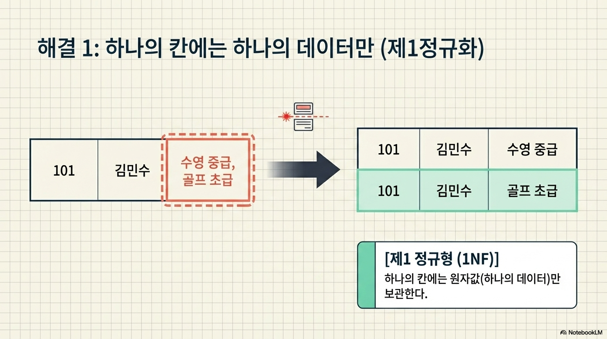


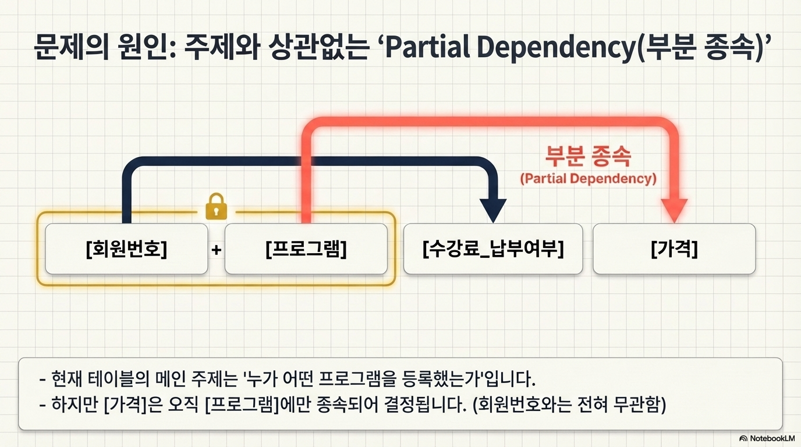
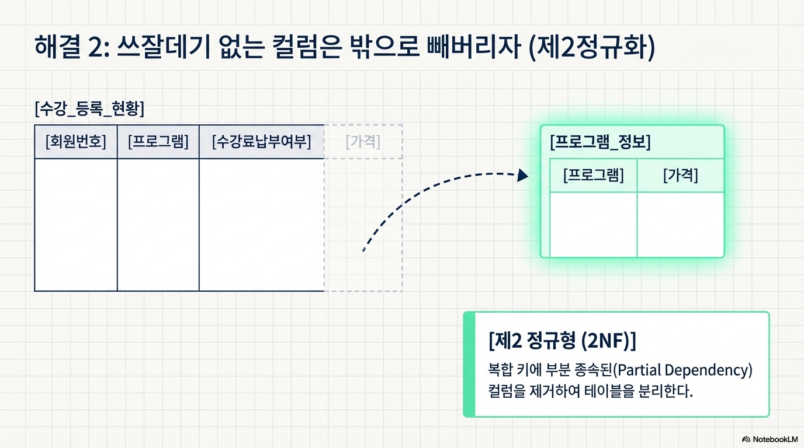
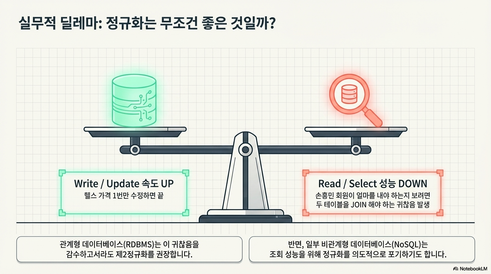
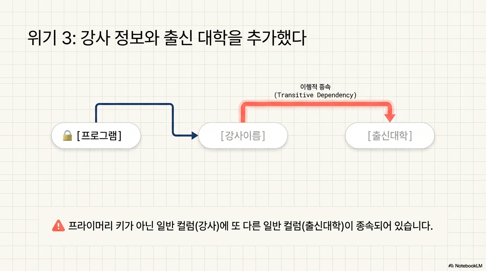
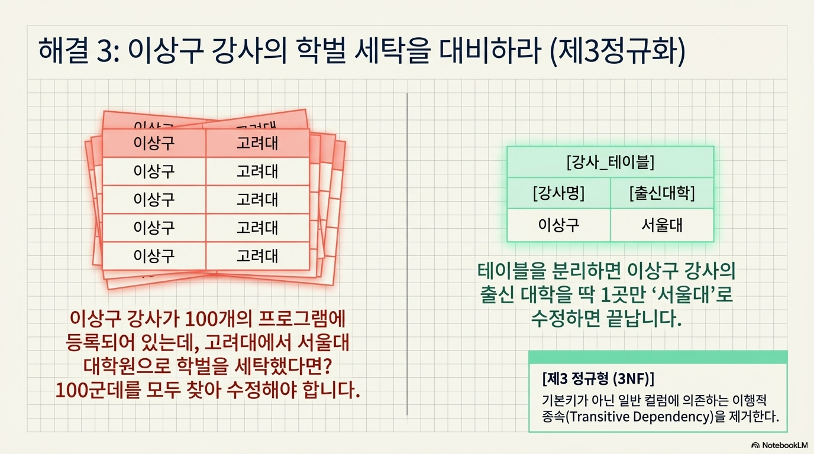
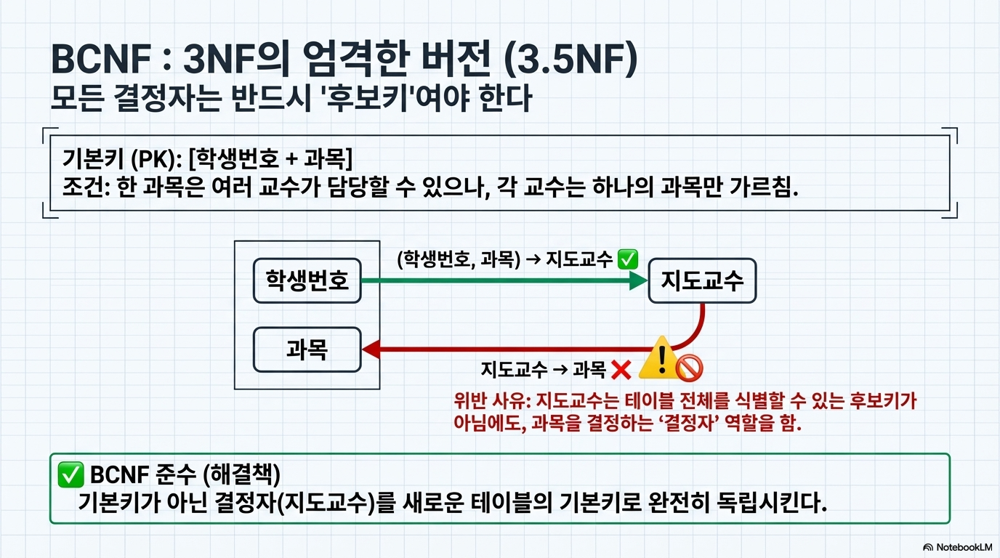

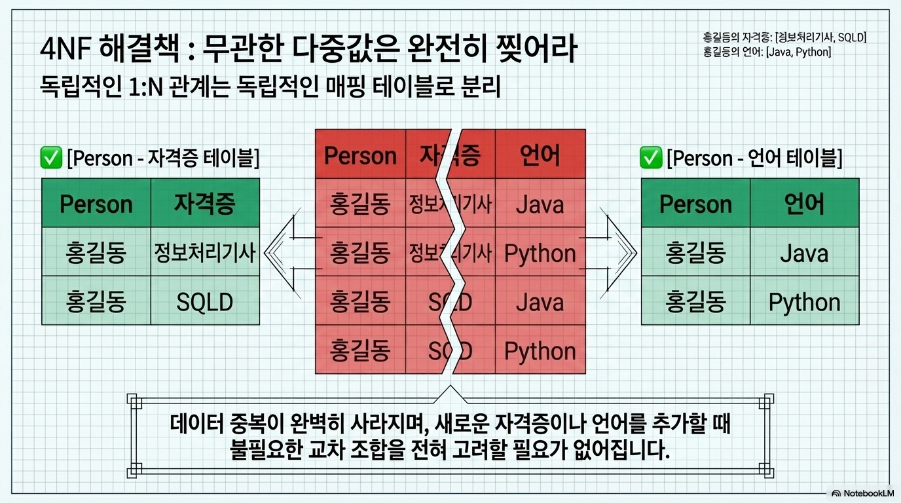
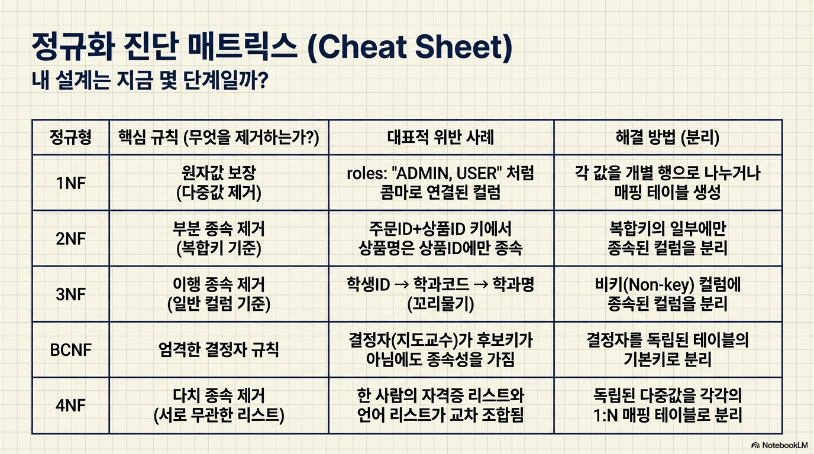


