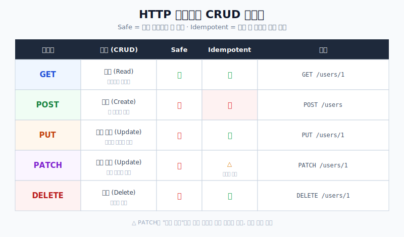
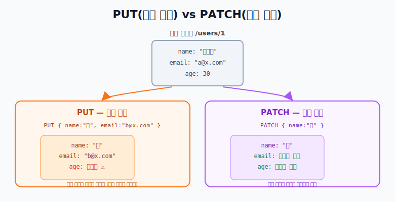
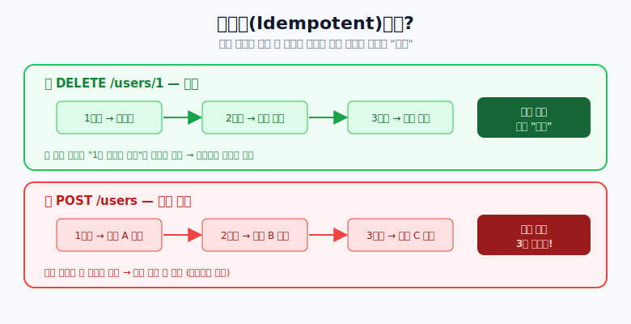

# HTTP 메소드와 REST

> 웹 개발자 면접 단골 주제. 각 메소드가 **무엇이고, 언제 쓰는지**를 실전 기준으로 정리한다.

## REST / RESTful API란?

- **REST(Representational State Transfer)**: 자원(Resource)을 **URI로 표현**하고,
  그 자원에 대한 행위를 **HTTP 메소드**(GET/POST/…)로 나타내는 아키텍처 스타일.
- **RESTful API**: 이 REST 원칙을 잘 지켜 설계한 API.

핵심 아이디어는 **"URI는 자원(명사), 행위는 HTTP 메소드"** 로 나누는 것이다.

```text
❌ GET  /getUser?id=1        (행위가 URI에 들어감)
❌ POST /deleteUser?id=1
⭕ GET    /users/1           (자원=users/1, 행위=GET)
⭕ DELETE /users/1
```

---

## 한눈에 보기



- **Safe(안전)**: 서버의 데이터를 **바꾸지 않는** 메소드 (GET).
- **Idempotent(멱등)**: **같은 요청을 여러 번 보내도 서버의 최종 상태가 같은** 메소드.

이 두 개념이 면접에서 자주 나온다. 아래에서 자세히 본다.

---

## 각 메소드 상세

### GET — 조회 (Read)

- 자원을 **가져오기만** 한다. 서버 상태를 바꾸지 않는다(**Safe**).
- 여러 번 호출해도 결과가 같다(**Idempotent**).
- 원칙적으로 **요청 본문(body)을 쓰지 않고**, 조건은 쿼리 파라미터로 전달한다.

```text
GET /users/1
GET /users?page=2&size=20
```

### POST — 생성 (Create)

- 새로운 자원을 **생성**한다. 서버 상태를 바꾼다(Not Safe).
- 보낼 때마다 새 자원이 생기므로 **멱등이 아니다**. (같은 요청 3번 → 3개 생성)
- 성공 시 보통 **201 Created** 를 반환한다.

```text
POST /users
Body: { "name": "한창희", "email": "a@x.com" }
```

### PUT — 전체 수정 (Update)

- 자원을 **통째로 교체**한다. **보낸 내용으로 전체를 덮어쓴다.**
- 같은 요청을 여러 번 보내도 결과가 같으므로 **멱등**이다.

### PATCH — 부분 수정 (Update)

- 자원의 **일부 필드만** 변경한다. 보낸 필드만 바꾸고 나머지는 유지.
- "부분 수정"이라 요청 내용에 따라 멱등일 수도, 아닐 수도 있다.



> **PUT vs PATCH 요약**
> - `PUT { name, email }` → age 같은 **빠진 필드는 사라진다** (전체 교체).
> - `PATCH { name }` → name만 바뀌고 **email·age는 그대로** (부분 수정).

### DELETE — 삭제 (Delete)

- 자원을 **삭제**한다.
- 이미 지워진 자원을 또 지워도 "없는 상태"로 동일하므로 **멱등**이다.

---

## 멱등성(Idempotent)이 왜 중요한가

네트워크는 불안정해서 **같은 요청이 중복 전송**될 수 있다(타임아웃 후 재시도 등).
이때 멱등한 메소드는 **몇 번 보내도 안전**하지만, 멱등하지 않은 POST는 중복 생성 위험이 있다.



- `DELETE /users/1` 를 3번 보내도 → 최종 상태는 항상 "1번 유저 없음" (안전)
- `POST /users` 를 3번 보내면 → 유저가 3명 생성됨 (위험 → 중복 방지 설계 필요)

---

## 자주 나오는 상태 코드

| 코드 | 의미 | 주로 언제 |
| --- | --- | --- |
| 200 OK | 성공 | GET, PUT, PATCH 성공 |
| 201 Created | 생성됨 | POST로 자원 생성 성공 |
| 204 No Content | 성공, 본문 없음 | DELETE 성공 등 |
| 400 Bad Request | 잘못된 요청 | 파라미터/형식 오류 |
| 401 / 403 | 인증 / 권한 없음 | 로그인 필요 / 접근 금지 |
| 404 Not Found | 자원 없음 | 없는 URI 조회 |
| 500 Internal Server Error | 서버 오류 | 서버 내부 예외 |

---

## RESTful 설계 팁

- **URI는 명사(자원), 소문자, 복수형** 을 권장: `/users`, `/orders/1/items`
- 행위는 URI가 아니라 **HTTP 메소드**로 표현한다.
- 계층 관계는 경로로: `/users/1/orders` (1번 유저의 주문들)
- 응답 형식과 에러 코드 체계를 **일관되게** 통일한다.

---

## 결론

- **GET(조회) / POST(생성) / PUT(전체수정) / PATCH(부분수정) / DELETE(삭제)** — 자원에 대한 행위를 메소드로 표현.
- 면접 포인트: **Safe(GET)** 와 **Idempotent(GET/PUT/DELETE)** 개념, 그리고 **PUT vs PATCH**, **POST가 멱등이 아닌 이유**.
