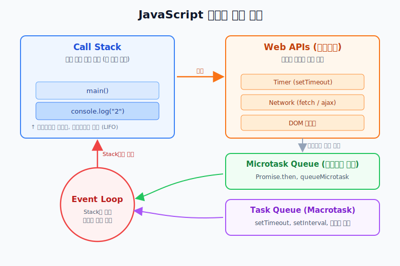
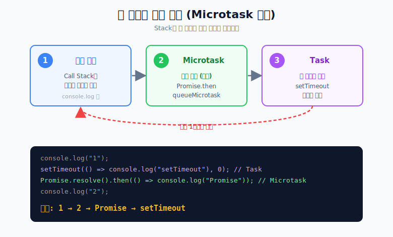
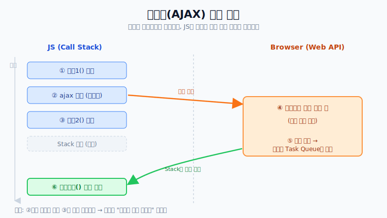

# JavaScript 동작 원리

## 핵심 요약

JavaScript는 기본적으로 싱글 스레드다.  
실행 순서는 다음 규칙으로 반복된다.

1. `Call Stack`에 있는 동기 코드를 끝까지 실행
2. `Microtask Queue`를 전부 비움 (`Promise.then`, `queueMicrotask`)
3. `Task Queue(Macrotask)`에서 하나 꺼내 실행 (`setTimeout`, `setInterval`, DOM 이벤트 등)
4. 다시 1번으로 반복

## 실행 구조



- **Call Stack**: 지금 실행 중인 코드가 쌓이는 곳 (한 번에 하나)
- **Web APIs**: Timer / Network / DOM 등 비동기 작업을 브라우저가 대신 처리
- **Microtask Queue**: `Promise.then`, `queueMicrotask` (우선순위 높음)
- **Task Queue**: `setTimeout`, 이벤트 콜백 등 (Macrotask)
- **Event Loop**: Call Stack이 비면 큐에서 콜백을 꺼내 Stack으로 올림

## `setTimeout(0)`이 바로 실행되지 않는 이유

```javascript
console.log("1");

setTimeout(() => {
  console.log("3");
}, 0);

console.log("2");

// 1 -> 2 -> 3
```

`setTimeout(0)`도 바로 Stack에 들어가지 않는다.  
Web API를 거쳐 Task Queue에서 기다리고, Stack이 비워진 뒤에야 실행된다.

## Microtask가 Task보다 먼저 실행됨

```javascript
console.log("1");

setTimeout(() => console.log("setTimeout"), 0); // Task Queue
Promise.resolve().then(() => console.log("Promise")); // Microtask Queue

console.log("2");

// 1 -> 2 -> Promise -> setTimeout
```

즉, "대기실"이 하나가 아니라 우선순위가 높은 Microtask 대기실이 따로 있다.



한 사이클에서 Microtask는 **전부** 비우지만, Task는 **하나만** 꺼내 실행하고 다시 처음으로 돌아간다.

## AJAX가 동시에 도는 것처럼 보이는 이유

```javascript
작업1();

ajax({
  success: function () {
    성공처리();
  }
});

작업2();
```

실행 흐름:

1. `작업1` 실행
2. AJAX 요청만 브라우저에 위임
3. `작업2` 실행
4. 응답이 오면 콜백이 Queue에 들어가고, Stack이 비면 실행



## `success`는 무조건 `작업2` 뒤에 실행되나?

위처럼 같은 호출 흐름 안에서 작성했다면 그렇다.  
응답이 매우 빨라도 현재 Stack이 비기 전에는 콜백이 실행되지 않는다.

다만 `작업2`가 무거운 연산이면, 콜백 실행은 더 늦어진다.

## `ajax` vs `fetch` 차이

`fetch`는 Promise 기반이라 `.then/.catch/.finally` 콜백이 Microtask Queue로 들어간다.

```javascript
ajax({ success: () => console.log("ajax") }); // 보통 Task 계열
fetch("/api").then(() => console.log("fetch")); // Microtask
setTimeout(() => console.log("setTimeout"), 0); // Task

console.log("작업2");
```

동기 코드인 `작업2`가 항상 먼저 실행된다.

```text
작업2 -> (그 다음은 상황에 따라 다름)
```

> ⚠️ **주의**: `작업2` 이후의 순서는 단순히 "Microtask가 먼저"로 단정할 수 없다.
> `fetch`와 `ajax`는 **네트워크 응답이 도착해야** 콜백이 큐에 등록된다.
> 반면 `setTimeout(0)`은 네트워크가 필요 없으므로, 실제로는 보통
> `setTimeout`이 `fetch`/`ajax`보다 **먼저** 실행된다.
>
> Microtask 우선순위는 **콜백이 이미 큐에 준비된 상태에서 비교할 때만** 의미가 있다.
> 즉 `fetch.then`(Microtask)이 `setTimeout`(Task)보다 먼저인 것은,
> **fetch 응답이 이미 도착한 시점**을 기준으로 했을 때의 이야기다.

## fetch 여러 개일 때 순서

```javascript
fetch("/api1")
  .then(() => console.log("fetch1-then1"))
  .then(() => console.log("fetch1-then2"));

fetch("/api2")
  .then(() => console.log("fetch2-then1"))
  .then(() => console.log("fetch2-then2"));
```

정리:

- `fetch1-then1 -> fetch1-then2`: 순서 보장
- `fetch2-then1 -> fetch2-then2`: 순서 보장
- `fetch1` 체인과 `fetch2` 체인 사이의 상대 순서: 보장 안 됨 (응답 타이밍 영향)

## 결론

1. Stack이 먼저다.
2. Stack이 비면 Microtask를 먼저 전부 처리한다.
3. 그 다음 Task를 처리한다.
4. `fetch.then`은 Microtask라서, 응답이 준비된 시점 기준으로 `setTimeout`류보다 먼저 실행될 수 있다.


