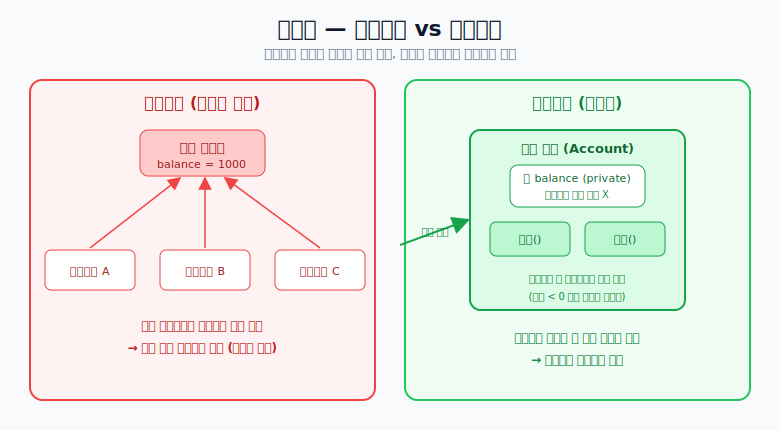
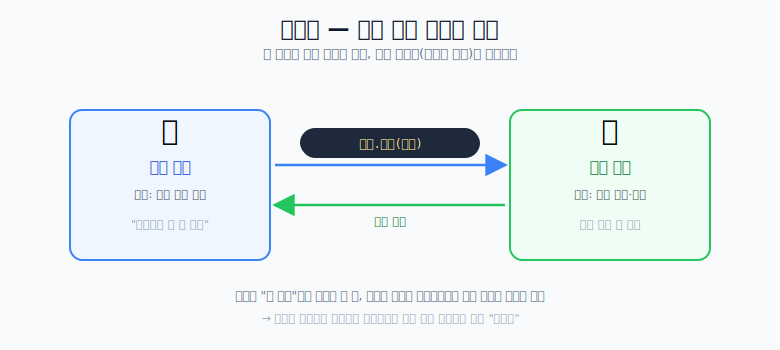
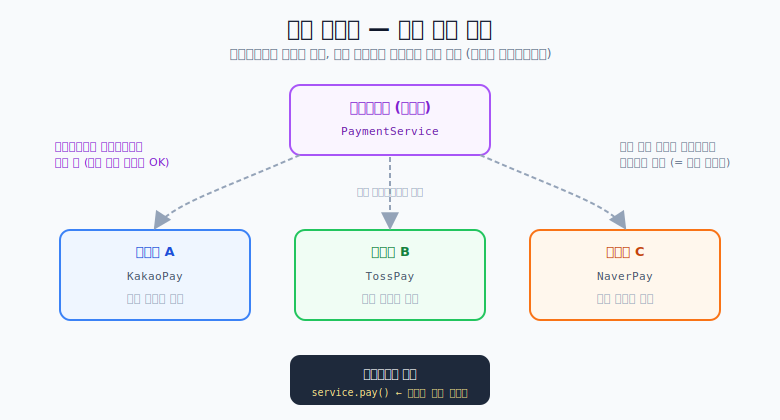

# 객체지향

> 객체지향은 "복잡한 프로그램을 **객체(역할을 가진 부품)** 단위로 나누고, 이들이 협력하게 만드는" 패러다임이다.
> 아래 다섯 개념을 예시(주로 은행 계좌)로 정리한다.

---

## 1. 추상화 (Abstraction)

- 좋은 코드를 짜려면 복잡한 코드를 **나누고 묶어서 정리**해야 한다.
- 세부 구현은 몰라도 **상위 개념만 보고** 프로그램을 만들 수 있게 하는 것.

예를 들어 자동차를 운전할 때 엔진 내부 원리를 몰라도 "핸들·페달"이라는 상위 개념만으로 운전할 수 있다.
코드도 마찬가지로, 세부 내용을 감추고 필요한 것만 드러낸다.

---

## 2. 캡슐화 (Encapsulation)

객체지향 이전에는 **절차지향**이었다. 특히 데이터와 이를 처리하는 **프로시저(절차)** 가 분리돼 있었다.

프로시저를 추상화하다 보면 **여러 프로시저가 같은 데이터에 마음대로 접근**하게 되고,
그 결과 "누가 언제 데이터를 바꿨는지" 알 수 없어 **데이터가 꼬인다.**

그래서 **데이터를 특정 메서드(프로시저)만 조작할 수 있도록** 범위를 정하는 것이 캡슐화다.



- 예) **계좌 객체**의 `잔액(balance)` 은 외부에서 직접 못 건드리게 감추고(`private`),
  `입금()` · `출금()` 메서드로만 바꾸게 한다.
- 이러면 "잔액이 음수가 되면 안 된다" 같은 **검증도 그 메서드 안에서** 강제할 수 있다.

> 즉 캡슐화 = **데이터 은닉 + 데이터를 만질 수 있는 통로(메서드) 제한.**

---

## 3. 메시징 (Messaging)

객체마다 **자기 역할**이 있고, 서로 **메시지를 주고받으며 분업·협력**한다.
객체지향에서 "메시지를 보낸다"는 것은 곧 **메서드를 호출한다**는 뜻이다.



```text
사람객체.인출(계좌)   // 사람이 계좌에서 돈을 뺌
```

- 사람 객체는 "돈 빼줘"라고 **요청만** 하고, 실제 잔액 관리는 **계좌 객체가 알아서** 한다.
- 이렇게 객체들이 서로 데이터를 주고받고 일을 나눠 처리한다.

---

## 4. 인터페이스 (Interface)

객체 간의 의사소통을 **단순화**하기 위해 **인터페이스(추상적인 약속)** 를 이용한다.

- 클라이언트는 **인터페이스만 보고 요청**하면 된다.
- 내부 구현 코드가 어떻게 생겼는지는 **클라이언트가 알 필요 없다.**

예를 들어 "결제해줘(`pay()`)"라는 인터페이스만 알면, 그 안에서 카드/계좌/포인트 중 무엇으로
처리하는지는 몰라도 된다. 이렇게 하면 **구현이 바뀌어도 사용하는 쪽 코드는 안 바뀐다.**

---

## 5. 동적 바인딩 (Dynamic Binding) = "갈아 끼워 쓴다"

만들 때부터 **구현체를 갈아 끼우는 것을 전제**로 클래스·인터페이스를 설계하는 것.
실제로 **어떤 구현이 실행될지는 런타임(실행 시점)에 결정**된다.

> 비유: **분리형 드라이버.** 손잡이(인터페이스)는 그대로 두고,
> 상황에 맞는 비트(구현체 — 일자/십자/육각)를 그때그때 끼워 쓴다.



- 이것도 결국 **인터페이스 + 다형성** 이야기다. 같은 `pay()` 호출이어도
  실제로는 `KakaoPay`가 실행될 수도, `TossPay`가 실행될 수도 있다.
- **스프링의 수많은 모듈**이 이미 이 방식(인터페이스 + 구현체 주입)으로 동작한다. (DI/의존성 주입)

---

## 보충: 흔히 말하는 "객체지향 4대 특성"과의 관계

면접에서는 보통 **추상화 · 캡슐화 · 상속 · 다형성** 을 4대 특성으로 든다.
이 문서의 개념들과 연결하면:

| 이 문서의 개념 | 4대 특성과의 관계 |
| --- | --- |
| 추상화 | 그대로 **추상화** |
| 캡슐화 | 그대로 **캡슐화** (데이터 은닉) |
| 메시징 / 인터페이스 | 객체 협력의 방식 — **다형성**의 기반 |
| 동적 바인딩 | 런타임 **다형성** 그 자체 (실행 시점에 구현 결정) |

> 상속은 위 표에 직접 안 나오지만, 다형성(동적 바인딩)을 가능하게 하는 또 하나의 축이다.

---

## 결론

- 객체지향은 **역할을 가진 객체로 나누고(추상화·캡슐화), 서로 협력하게(메시징·인터페이스)** 만드는 것.
- 그 협력을 유연하게 해주는 핵심 장치가 **인터페이스 + 동적 바인딩(다형성)** 이고,
  스프링 같은 프레임워크가 바로 이 원리 위에서 돌아간다.
