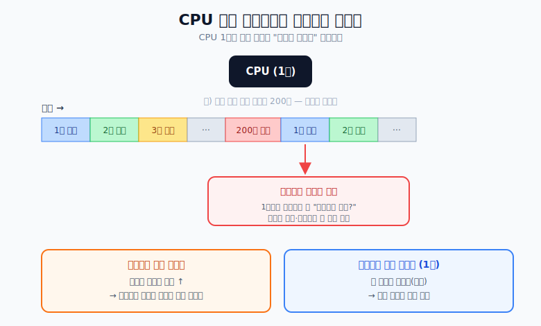
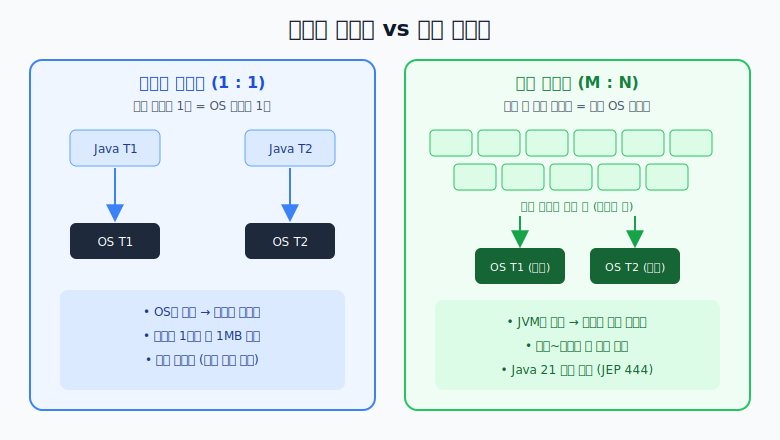
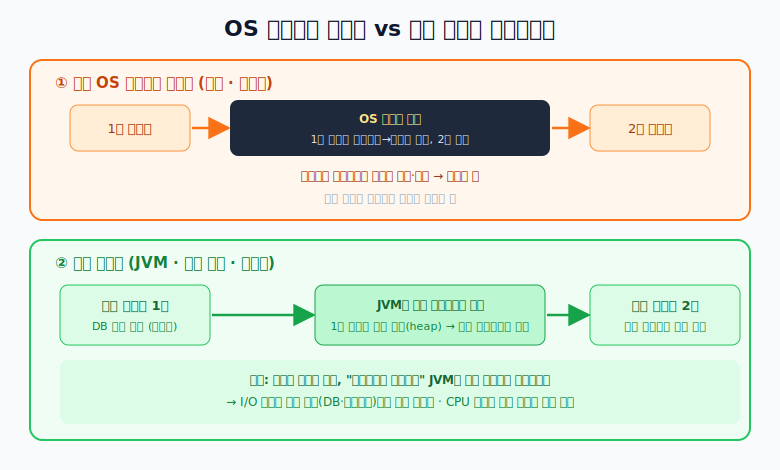

# 스레드 컨텍스트 스위칭과 Java Virtual Threads

## 핵심 요약

- CPU는 여러 요청을 **조금씩 번갈아** 처리한다 (Time Slicing).
- 스레드를 바꿀 때마다 "어디까지 했는지" 저장·복원하는 **컨텍스트 스위칭 비용**이 든다.
- 스레드가 **너무 많으면** 스위칭 비용이 커지고, **너무 적으면** 병목 시 계속 대기한다.
- Java 21의 **가상 스레드**는 이 스위칭을 커널이 아닌 JVM(유저 모드)에서 처리해, 수만 개를 만들어도 가볍게 동작한다.

---

## 톰캣 스레드는 왜 200개일까?

CPU가 1개라고 가정하고, 스레드 200개에 요청 200개가 동시에 왔다고 하자.

이때 200개를 하나씩 끝까지 처리하는 게 아니라,
**1번 일 조금 → 2번 일 조금 → … → 200번 일 조금 → 다시 1번 …** 이런 식으로
아주 빠르게 번갈아 가며 처리한다. 이걸 CPU의 **타임 슬라이싱(Time Slicing)** 이라고 한다.

문제는 1번 작업으로 **다시 돌아왔을 때** "어디서부터 이어서 해야 하지?"를 찾기 위해
직전 상태(레지스터 등)를 저장하고 복원해야 한다는 점이다. 이게 **컨텍스트 스위칭 비용**이다.

- 스레드가 **너무 많으면** → 번갈아 바꾸는 횟수가 늘어 스위칭 비용이 커진다.
- 스레드가 **너무 적으면(예: 1개)** → 한 작업이 막히면(병목) 다른 요청이 계속 기다린다.

그래서 톰캣은 기본 최대 스레드를 **200개** 정도로 잡아 이 둘 사이의 균형을 맞춘다.
(무조건 옳은 값이 아니라, 서버 사양·작업 성격에 따라 조정하는 기본값이다.)

> 참고: 이런 "대기하는 동안 놀지 말고 다른 일 하자"는 발상에서 나온 것이 **비동기 프로그래밍**이고,
> 그 연장선에서 등장한 것이 아래의 **가상 스레드(Virtual Threads)** 다.

---

## 기존 스레드 vs 가상 스레드

지금까지 이야기한 스레드는 정확히는 **플랫폼 스레드(Platform Thread)** 다.
OS(운영체제)가 직접 관리하는 일꾼이라 만들기도 무겁고(스레드당 약 1MB 점유) 개수도 제한적이다.

Java 21의 **가상 스레드**는 다르다.

- **플랫폼 스레드 (1:1 매칭)**: 자바 스레드 1개 = OS 스레드 1개 → 무겁고 비쌈
- **가상 스레드 (M:N 매칭)**: 수만 개의 가상 스레드가 소수의 OS 스레드(운반 스레드) 위에서 돌아감 → 매우 가볍고 쌈

가상 스레드가 올라타는 소수의 OS 스레드를 **운반 스레드(Carrier Thread)** 라고 부른다.

---

## OS가 하던 일을 JVM이 가져오다

기존에는 스레드를 바꾸는 권한이 **OS 커널**에 있었다.

- **기존 (OS 컨텍스트 스위칭)**
  "1번 스레드 멈춰! 1번의 모든 정보를 하드웨어 레지스터에서 메모리로 옮겨 적고,
  2번 정보를 다시 CPU에 세팅해!" → 커널을 오가야 해서 **비용이 크다.**

- **Java 21 (가상 스레드)**
  "OS야 넌 가만히 있어. 내가 관리하는 가상 스레드 1번이 지금 DB 응답을 기다린대.
  내가 JVM 메모리에 1번 상태만 잠깐 기록해두고(운반 스레드에서 내림),
  바로 2번을 운반 스레드에 올려 실행할게." → 커널을 안 거쳐서 **가볍다.**

즉, 가상 스레드가 **블로킹(예: DB·네트워크 응답 대기)** 되는 순간
JVM이 그 스레드를 운반 스레드에서 **내리고(unmount)** 다른 가상 스레드를 **올린다(mount).**
내려간 스레드의 상태(스택)는 힙에 잠깐 보관됐다가, 응답이 오면 다시 올라와 이어서 실행된다.

---

## 보충: 오해하기 쉬운 점

1. **"컨텍스트 스위칭 비용이 0이 된다"는 아니다.**
   비용이 사라지는 게 아니라, 커널이 아닌 **JVM(유저 모드)** 에서, 그것도
   **블로킹되는 시점에만** 갈아끼우기 때문에 **훨씬 싸지는** 것이다.

2. **가상 스레드는 I/O 바운드 작업에 강하다.**
   DB 조회·네트워크 호출처럼 **대기(블로킹)가 많은** 작업에서 큰 이득이 있다.
   반대로 CPU만 빡세게 쓰는 **CPU 바운드** 계산은 결국 코어 수에 묶이므로 가상 스레드로 바꿔도 큰 이득이 없다.

3. **"스레드 = 무조건 200개"가 정답은 아니다.**
   200은 톰캣의 기본값일 뿐, 작업이 대부분 I/O 대기라면 가상 스레드로 훨씬 많은 동시 요청을 처리할 수 있다.

---

## 결론

- 전통적 스레드 모델의 한계는 **컨텍스트 스위칭 비용**과 **OS 스레드 개수 제한**이었다.
- 가상 스레드는 스레드 스케줄링을 **JVM(유저 모드)** 로 가져와, 블로킹 시점에만 가볍게 갈아끼운다.
- 그래서 **I/O 대기가 많은 서버**에서 적은 OS 스레드로도 수만 개의 동시 작업을 처리할 수 있다.
