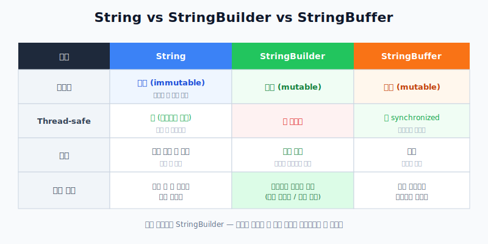
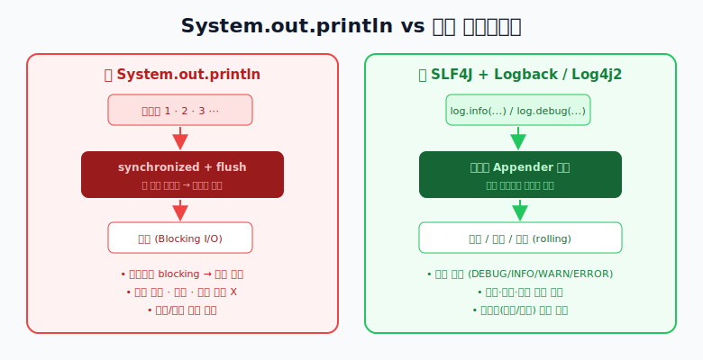
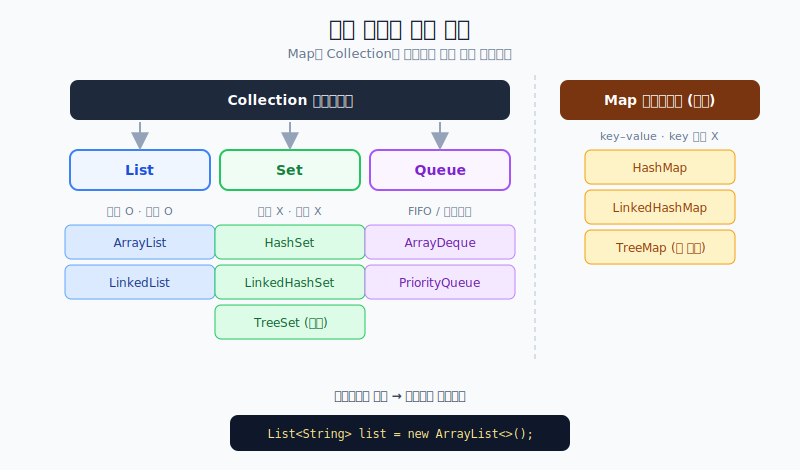
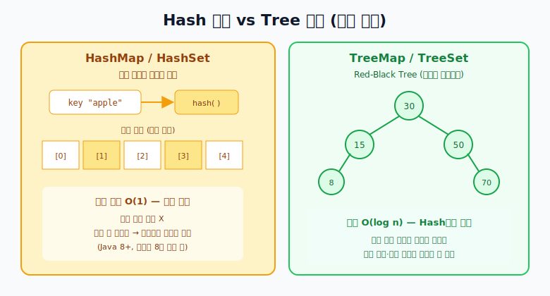

# 자바 기술 면접 (중급)

> 하나를 물으면 그 뒤에 **꼬리에 꼬리를 무는** 질문이 이어진다.
> 개념 하나를 "왜?"까지 파고들어 답할 수 있어야 한다.

---

## 1. String vs StringBuilder vs StringBuffer



### String은 왜 "불변(immutable)"인가?

`String`은 한 번 만들어지면 값을 바꿀 수 없다. `+` 로 이어붙이면 **기존 객체를 바꾸는 게 아니라 새 객체를 만든다.**

```java
String s = "a";
s = s + "b"; // "ab"라는 새 String 객체가 생김 (기존 "a"는 버려짐)
```

그래서 **반복문 안에서 String을 계속 이어붙이면** 매 반복마다 새 객체가 생겨 성능이 나쁘다.

> **String을 불변으로 만든 이유** (꼬리질문 대비)
> - **String Pool 캐싱**: 같은 문자열 리터럴을 공유해 메모리 절약 (값이 바뀌면 공유 불가)
> - **Thread-safe**: 값이 안 바뀌니 여러 스레드가 동시에 읽어도 안전
> - **hashCode 캐싱**: 불변이라 해시값을 한 번만 계산해 캐싱 → HashMap 키로 쓰기 좋음
> - **보안**: 파일 경로·DB URL 등이 중간에 바뀌는 것을 막음

### StringBuilder vs StringBuffer

둘 다 **가변(mutable)** 이라 내부 버퍼를 재사용해 문자열을 효율적으로 조립한다. 차이는 **동기화** 뿐이다.

| | StringBuilder | StringBuffer |
| --- | --- | --- |
| 동기화 | ❌ 없음 (비동기) | ⭕ `synchronized` |
| Thread-safe | ❌ | ⭕ |
| 속도 | 빠름 | 느림(동기화 비용) |

`synchronized`는 **한 번에 한 스레드만** 그 메서드에 들어오게 막는 장치다.
StringBuffer는 `append()` 등에 이게 걸려 있어 멀티스레드에서 안전하지만, 그만큼 느리다.

### 단일 스레드에서는? Spring 환경에서는?

- **단일 스레드**에서는 동기화가 필요 없으므로 **StringBuilder가 더 빠르다.**
- **Spring(웹 서버) 환경**에서도 대부분 **메서드 안의 지역 변수**로 StringBuilder를 쓴다.
  - 지역 변수는 **스레드마다 각자의 스택**에 생기므로 다른 요청 스레드와 겹치지 않는다 → 안전.
  - 즉, 굳이 StringBuffer를 쓸 필요가 거의 없다.
  - **주의**: StringBuilder를 여러 스레드가 공유하는 **필드(멤버 변수)** 로 두면 위험하다. 이럴 때만 동기화를 고민한다.

> **결론**: 기본은 StringBuilder. 여러 스레드가 하나의 인스턴스를 진짜로 공유할 때만 StringBuffer(또는 다른 동기화 전략)를 쓴다.
> 참고로 자바 컴파일러는 단순한 `"a" + "b"` 같은 `+` 연결은 내부적으로 StringBuilder로 바꿔주지만,
> **반복문 안**에서는 매 회차마다 StringBuilder가 새로 생길 수 있으므로 직접 StringBuilder를 쓰는 게 낫다.

---

## 2. System.out.println을 쓰지 말라는 이유



### Blocking I/O + 동기화 병목

- `System.out`은 `PrintStream`이고, `println`은 내부적으로 **`synchronized`** 되어 있다.
  여러 스레드가 동시에 출력하면 **한 줄씩 줄 서서** 처리된다.
- 게다가 `System.out`은 출력할 때마다 **flush(즉시 콘솔에 씀)** 하는 **blocking I/O**다.
  출력이 끝날 때까지 그 스레드는 **멈춰서 기다린다.**
- 그래서 요청이 많은(고TPS) 서버에서 `println`을 남발하면 **성능 병목**이 된다.

### 관리 측면의 문제

- **로그 레벨 제어가 안 된다** — 개발 때만 보고 운영에선 끄는 식의 구분이 불가.
- **포맷·시간·파일 분리·보관(rolling)** 같은 관리 기능이 없다.

### 대안: 로깅 프레임워크

**SLF4J + Logback / Log4j2** 를 쓴다.

```java
private static final Logger log = LoggerFactory.getLogger(MyClass.class);
log.info("주문 생성 완료: orderId={}", orderId);
log.debug("상세 디버그 정보");
```

- **레벨(DEBUG/INFO/WARN/ERROR)** 로 환경별 노출 제어
- **비동기 Appender**로 출력을 별도 스레드에 넘겨 blocking 최소화
- 파일 분리, 포맷, 운영/개발 설정 분리 가능

---

## 3. 컬렉션 (Collection)



### 큰 갈래: List / Set / Map

| 갈래 | 순서 | 중복 | 대표 구현체 |
| --- | --- | --- | --- |
| List | ⭕ 유지 | ⭕ 허용 | ArrayList, LinkedList |
| Set | ❌ 기본 없음 | ❌ 불허 | HashSet, LinkedHashSet, TreeSet |
| Map | ❌ 기본 없음 | key ❌ / value ⭕ | HashMap, LinkedHashMap, TreeMap |

> **주의**: `Map`은 `Collection` 인터페이스를 **상속하지 않는** 별도 계열이다. (key-value 쌍을 다루기 때문)

### List: ArrayList vs LinkedList

- **ArrayList**: 내부가 **배열**. 인덱스 접근이 O(1)로 빠르지만, 중간 삽입·삭제는 뒤 요소를 밀어야 해 O(n).
- **LinkedList**: 내부가 **노드 연결**. 중간 삽입·삭제는 유리하지만, 인덱스 접근은 앞에서부터 찾아 O(n).
- **실무 기본은 ArrayList** — 대부분의 상황에서 캐시 지역성 덕에 더 빠르다.

### Hash 계열 vs Tree 계열 (내부 구조)



- **Hash 계열 (HashMap / HashSet)**
  - 키에 **해시 함수**를 적용해 **버킷**에 저장 → 평균 조회 **O(1)** 로 매우 빠름.
  - **저장 순서는 보장하지 않는다.**
  - 해시 충돌이 나면 같은 버킷에 체이닝(연결)하고, Java 8부터는 한 버킷에 많이 쌓이면(8개 초과) **레드-블랙 트리**로 바꿔 성능을 지킨다.
- **Tree 계열 (TreeMap / TreeSet)**
  - **레드-블랙 트리**(자가 균형 이진탐색트리)로 저장 → 조회 **O(log n)** (Hash보다는 느림).
  - **항상 키가 정렬된 상태**로 유지된다 → 범위 검색, 정렬 출력이 필요할 때 유리.
- **LinkedHashMap / LinkedHashSet**: 해시의 빠름 + **입력(또는 접근) 순서 유지.**

### 어떤 걸 언제 쓰나

- 순서 있고 인덱스로 접근 → **ArrayList**
- 중복 제거만 필요 → **HashSet**
- 정렬된 상태가 필요 → **TreeSet / TreeMap**
- 입력 순서를 유지하고 싶다 → **LinkedHashSet / LinkedHashMap**
- 키-값 매핑 + 빠른 조회 → **HashMap**

### 다형성으로 선언하기

구현체가 아니라 **인터페이스 타입**으로 선언하면, 나중에 구현체만 바꿔 끼울 수 있다.

```java
List<String> list = new ArrayList<>();   // 필요 시 new LinkedList<>() 로 교체
Map<String, User> map = new HashMap<>();  // 정렬 필요하면 new TreeMap<>() 로 교체
```

> 이는 앞서 [객체지향](./객체지향.html)에서 본 **인터페이스 + 동적 바인딩**의 실제 사례다.

---

## 마무리

- **String 불변** → 그래서 StringBuilder/StringBuffer가 필요하고, 둘의 차이는 **동기화 유무**.
- **System.out.println** → **동기화 + blocking I/O**라 성능·관리에 불리 → **로깅 프레임워크** 사용.
- **컬렉션** → List/Set/Map의 특성과 **Hash(빠름·무순서) vs Tree(느림·정렬)** 의 내부 구조를 이해하고, **인터페이스 타입으로 선언**해 유연하게 쓴다.
