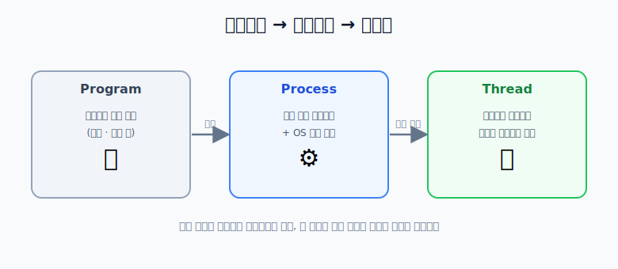
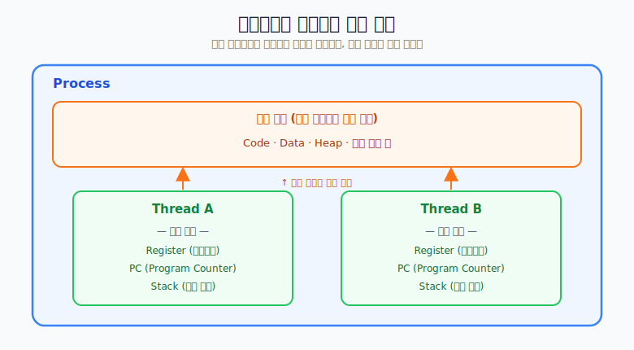
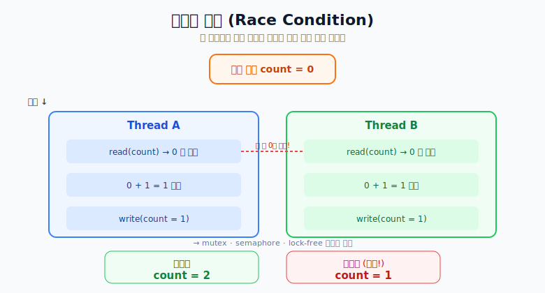

# 프로세스와 스레드 차이

## 한 번에 보는 큰 그림



- 프로그램: 아직 실행되지 않은 정적 파일
- 프로세스: 실행 중인 프로그램 (메모리/CPU 시간 등 자원 할당)
- 스레드: 프로세스 안에서 실제로 코드를 실행하는 흐름

## 프로그램 vs 프로세스

### 프로그램

- 실행 전의 코드/데이터 묶음
- 저장 장치에 있는 정적 상태

### 프로세스

- 실행 중인 프로그램
- 운영체제가 관리하는 독립 실행 단위
- 주소 공간과 실행 문맥(context)을 가짐

## 프로세스 메모리 구조

```text
높은 주소
+-----------------------------+
| Stack (함수 호출, 지역 변수) |
+-----------------------------+
| Heap (동적 할당 메모리)      |
+-----------------------------+
| Data (전역/static 변수)      |
+-----------------------------+
| Text/Code (실행 코드)        |
+-----------------------------+
낮은 주소
```

프로세스는 단순한 코드 덩어리가 아니라, 실행을 위한 메모리 구조 전체를 포함한다.

## 운영체제와 여러 프로세스

```text
+--------------------------------------------------+
| Operating System                                 |
|  - 스케줄러가 CPU 시간을 분배                    |
|                                                  |
|  +-----------+  +-----------+  +-----------+    |
|  | Process A |  | Process B |  | Process C |    |
|  +-----------+  +-----------+  +-----------+    |
+--------------------------------------------------+
```

사용자 입장에서는 동시에 실행되는 것처럼 보이고, 운영체제는 매우 빠르게 실행 순서를 바꿔가며 처리한다.

## 스레드란?
하나의 프로세스 내부에서 실행되는 흐름 단위다.  
복잡한 프로그램(브라우저, IDE, 게임 등)은 보통 여러 스레드로 일을 나눈다.

예:

- 입력 처리
- 화면 렌더링
- 네트워크 통신
- 파일 I/O

## 프로세스와 스레드의 관계



핵심:

- 같은 프로세스의 스레드는 많은 자원을 공유(Code / Data / Heap / 열린 파일 등)
- 각 스레드는 자기 스택/레지스터/PC(Program Counter)는 별도 보유

## 차이 요약

| 항목 | 프로세스 | 스레드 |
| --- | --- | --- |
| 정의 | 실행 중인 프로그램 단위 | 프로세스 내부 실행 흐름 |
| 주소 공간 | 프로세스마다 독립 | 같은 프로세스 내 공유 |
| 자원 공유 | 기본적으로 다른 프로세스와 분리 | 같은 프로세스 자원 공유 |
| 생성/전환 비용 | 상대적으로 큼 | 상대적으로 작음(일반적으로) |
| 장애 영향 | 보통 프로세스 경계로 격리 | 같은 프로세스 내 전파 가능 |

## 멀티스레드

하나의 프로세스 안에서 여러 스레드를 실행해 동시성(concurrency)을 높이는 방식.

```text
Process(Web App)
├─ Thread 1: UI 이벤트 처리
├─ Thread 2: 네트워크 요청
├─ Thread 3: 백그라운드 계산
└─ Thread 4: 로그/파일 처리
```

장점:

- 응답성 향상
- 자원 공유가 쉬워 작업 분담 효율 증가
- 같은 프로세스 내 전환 비용이 상대적으로 낮음

단점:

- 동기화 문제(경쟁 상태, 데드락 등)
- 디버깅 난이도 상승
- 한 스레드 오류가 프로세스 전체 안정성에 영향 가능

## 동기화 문제가 생기는 이유



두 스레드가 `count`를 거의 동시에 읽으면 둘 다 `0`을 읽고 각각 `1`을 쓰기 때문에,
두 번 증가시켰는데도 결과가 `2`가 아니라 `1`이 된다.
그래서 `mutex`, `semaphore`, `lock-free` 같은 전략이 필요하다.

## 프로세스끼리 통신은?

다른 프로세스 메모리에 직접 접근은 기본적으로 불가.  
대신 운영체제가 IPC를 제공한다.

- 파이프
- 소켓
- 메시지 큐
- 공유 메모리

## 컨텍스트 스위칭

```text
CPU 실행 중: Task A
   저장(A의 레지스터/상태)
   복원(B의 레지스터/상태)
CPU 실행 중: Task B
```
프로세스 전환은 주소 공간 전환까지 동반되어 보통 더 무겁고,  
스레드 전환은 같은 프로세스 내부라 일반적으로 더 가볍다.

## 자주 헷갈리는 포인트(정확한 표현)

1. "프로세스는 절대 메모리 공유를 못 한다"
   - 정확히는 기본적으로 독립이고, 필요하면 공유 메모리 IPC로 공유 가능
2. "멀티스레드 = 항상 병렬 처리"
   - 단일 코어에서는 동시성 중심, 멀티 코어에서는 병렬성까지 가능
3. "스레드가 항상 빠르다"
   - 일반적으로 유리하지만, 동기화/락 경합이 크면 오히려 느려질 수 있음

## 결론

프로세스는 실행 환경 단위, 스레드는 그 안의 실행 흐름 단위다.  
이 구분을 정확히 이해하면 멀티태스킹, 동시성, 성능 최적화를 훨씬 명확하게 볼 수 있다.


