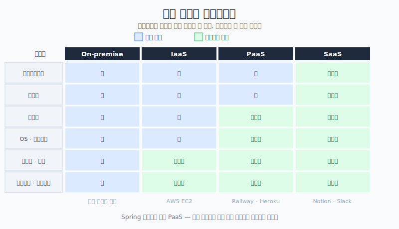
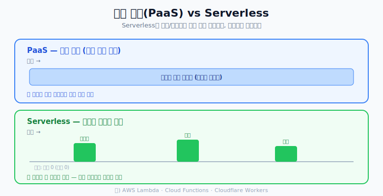
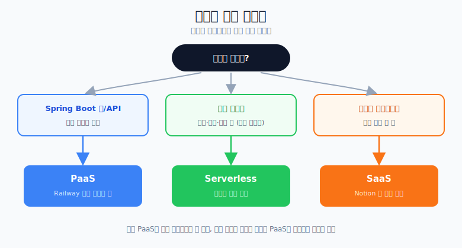

# PaaS / SaaS / Serverless 한 번에 정리

> "○○ as a Service"는 **내가 관리하던 것을 어디까지 남(제공자)에게 맡기느냐**의 차이다.

## 누가 무엇을 관리하는가

인프라는 여러 층(네트워크 → 서버 → OS → 런타임 → 앱)으로 이루어져 있다.
이 중 **어디까지를 제공자가 대신 맡아주느냐**로 나뉜다.

- **On-premise**: 서버실부터 전부 내가 관리 (가장 무거움)
- **IaaS** (예: AWS EC2): 하드웨어·가상화는 제공자, **OS부터 위는 내가**
- **PaaS** (예: Railway): **앱과 데이터만 내가**, 나머지는 제공자
- **SaaS** (예: Notion): 전부 제공자 — 나는 그냥 **쓰기만**

---

## 1) PaaS (Platform as a Service)

- **의미**: 앱 코드를 올리면 인프라 운영을 플랫폼이 대신 처리
- **예시**: Railway, Render, Heroku, Google App Engine
- **잘 맞는 경우**: Spring Boot 웹 API, 백오피스, 일반 서비스 서버

## 2) SaaS (Software as a Service)

- **의미**: 이미 완성된 소프트웨어를 구독해서 사용
- **예시**: Notion, Slack, Gmail, Figma
- **잘 맞는 경우**: 직접 개발하는 대신 기능을 바로 써야 할 때

## 3) Serverless

- **의미**: 요청/이벤트가 있을 때만 함수가 실행되고 **사용량만큼만 과금**
- **예시**: AWS Lambda, Google Cloud Functions, Azure Functions, Cloudflare Workers
- **잘 맞는 경우**: 배치, 파일 변환, 알림 발송, 이벤트 후처리

> PaaS/SaaS는 "인프라를 얼마나 맡기느냐"의 축이라면, **Serverless는 "실행 방식"의 축**이다.
> 즉 상시 켜진 서버가 아니라, **필요할 때만 잠깐 켜졌다 꺼지는** 모델이다.

- 상시 서버(PaaS)는 요청이 없어도 계속 돌아가 **평소에도 비용**이 든다.
- Serverless는 이벤트가 있을 때만 실행되어 **그 순간만 과금**된다. (평소엔 0)

---

## Spring 개발자는 어떻게 하면 되나

- 기본적으로 **Spring Boot 프로젝트를 PaaS에 올리면** 된다.
- Spring Boot 프로젝트를 만든 순간부터, **Serverless 제품은 안 써도 되는 경우가 많다.**

**Serverless가 떠오르는 상황 예시**

- 한 달에 딱 한 번, 월말 새벽 3시에만 도는 **대규모 정산** 이나 **전체 회원 알림 발송** 같은 작업
- 이런 걸 위해 PaaS 사양을 평상시에도 높여두면 **낭비가 심하다.**
- 그래서 "가끔 필요한 대규모 작업만 Serverless로 빼서 필요할 때만 실행"하는 전략을 썼다.

**하지만 요즘은?**

- 요즘 PaaS 제품들도 **자동 스케일링**이 잘 돼서, 굳이 Serverless를 따로 쓸 필요가 없는 경우가 많다.

---

## 결론: 어떤 걸 고를까

- **Spring Boot 프로젝트를 만들었다** → 그냥 **Railway 같은 PaaS** 하나 골라서 잘 쓰면 됨
- **Spring 없이 특정 작업만** 할 거다 → 애초에 **Serverless** 로 구현
- **SaaS** 는 개발과는 별개 — Notion 같은 완성품을 잘 골라 쓰면 끝
