# 개발리뷰와 PR Merge

- 원본 파일: [The_Code_Review_Playbook.pptx](개발리뷰와PrMerge_image/The_Code_Review_Playbook.pptx)

## 요약

- 좋은 코드 리뷰는 단순 승인보다 품질, 유지보수성, 협업 효율을 높이는 데 목적이 있다.
- PR은 작고 명확하게 나누고, 리뷰 기준(기능/가독성/테스트/안전성)을 맞춰 확인하는 것이 핵심이다.
- 머지 전후 체크리스트를 일관되게 운영하면 회귀를 줄이고 팀 생산성을 높일 수 있다.

## 슬라이드 원본 보기

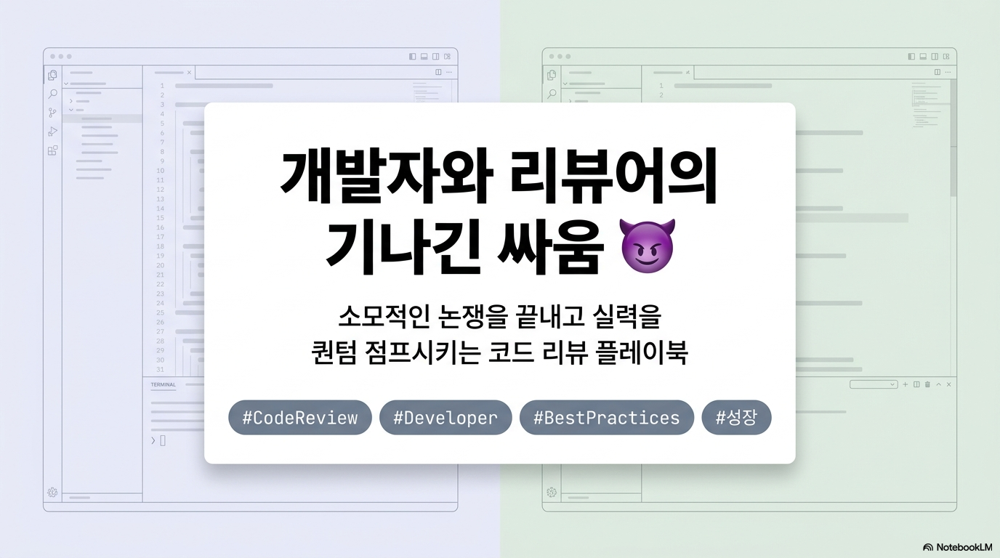
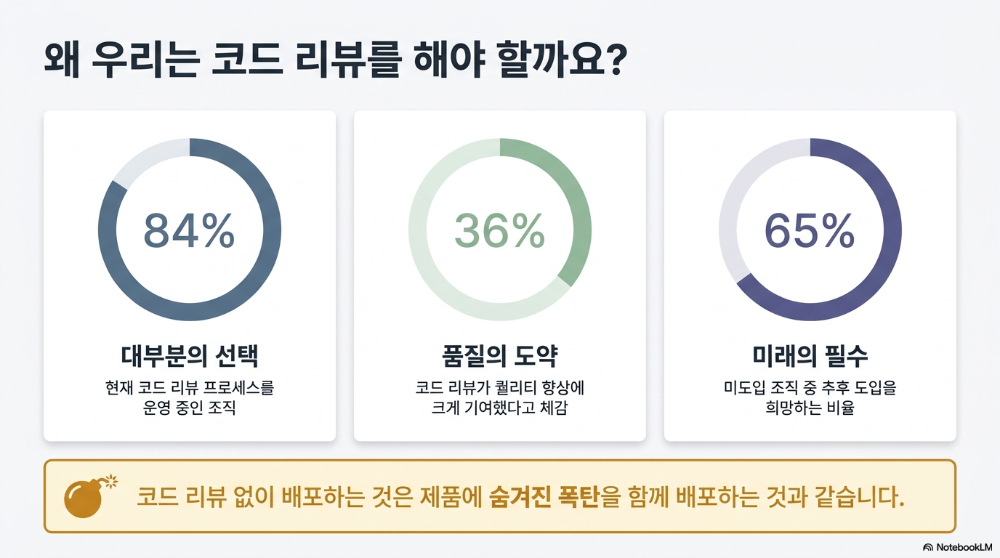
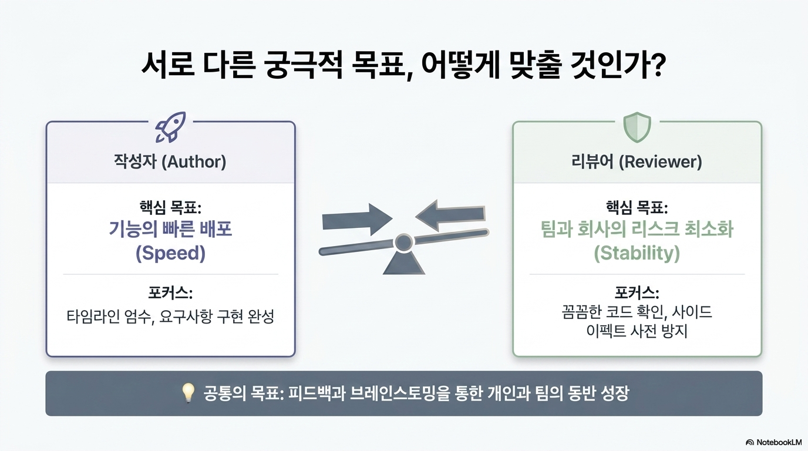

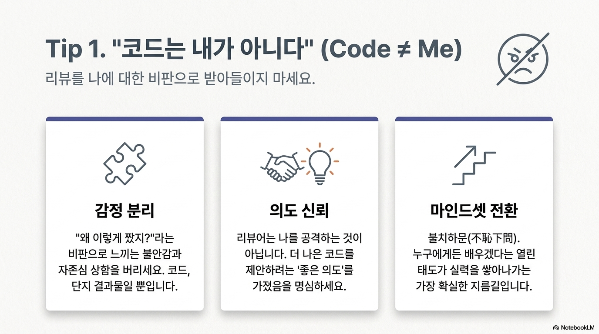
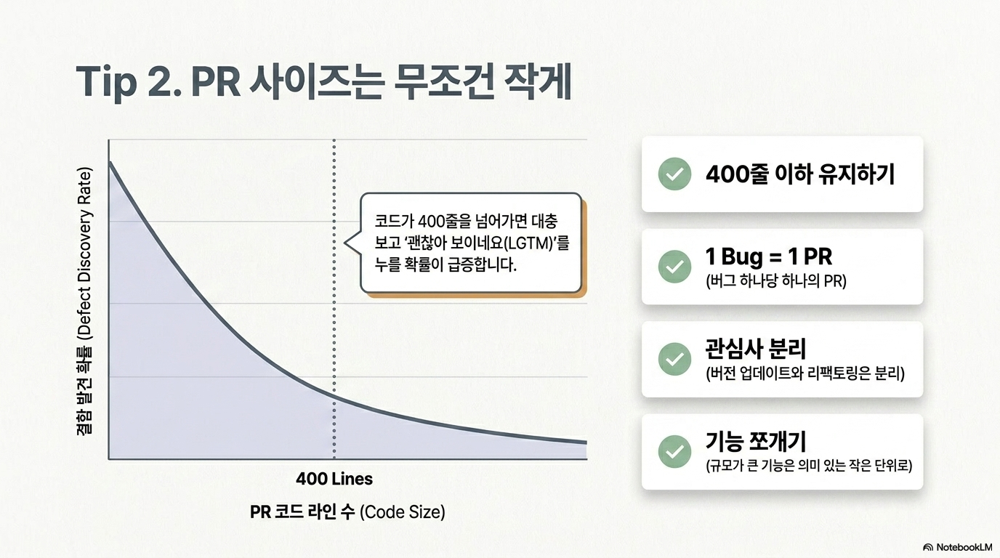
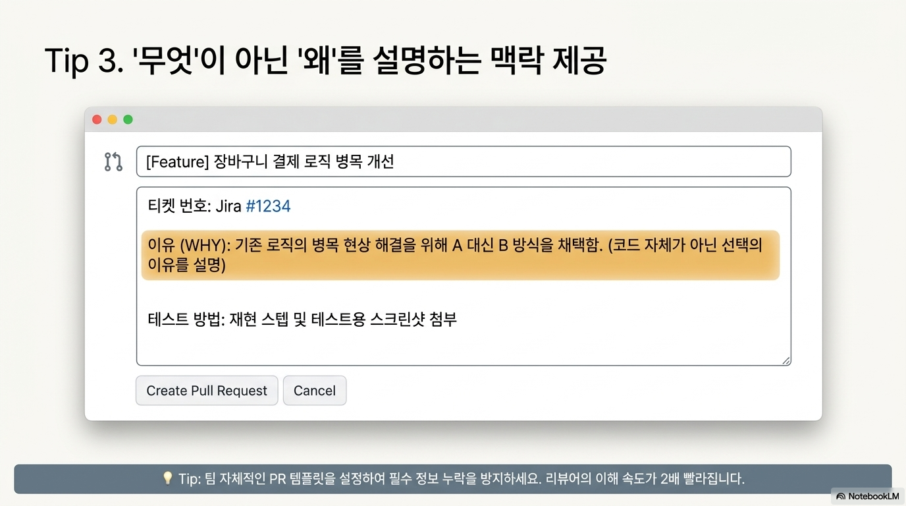
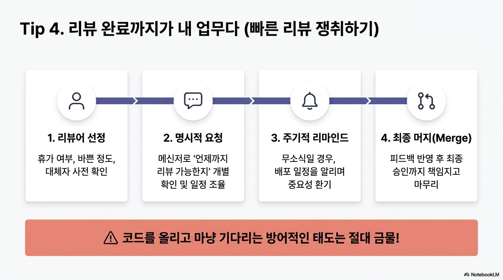
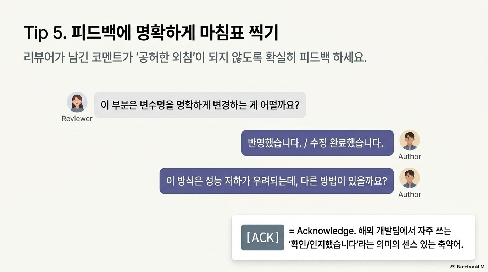

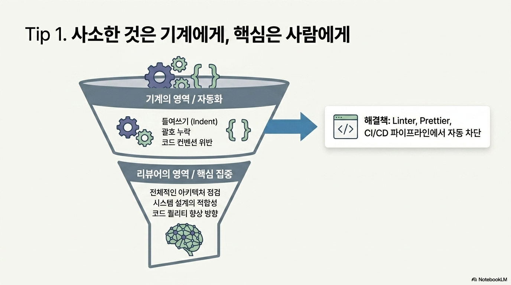
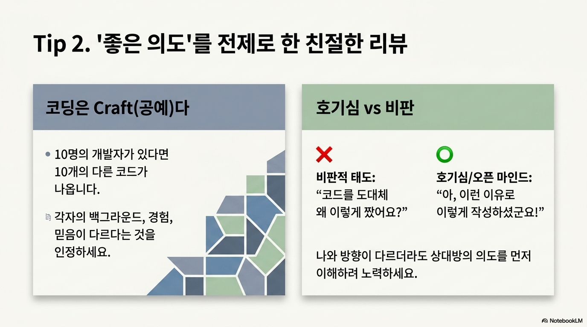
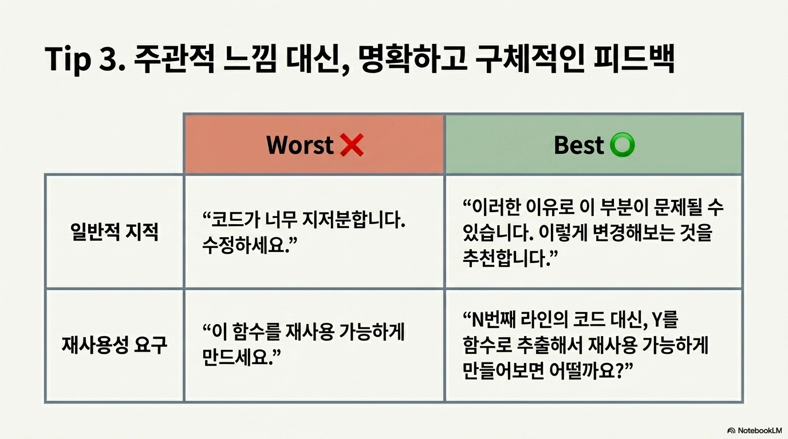
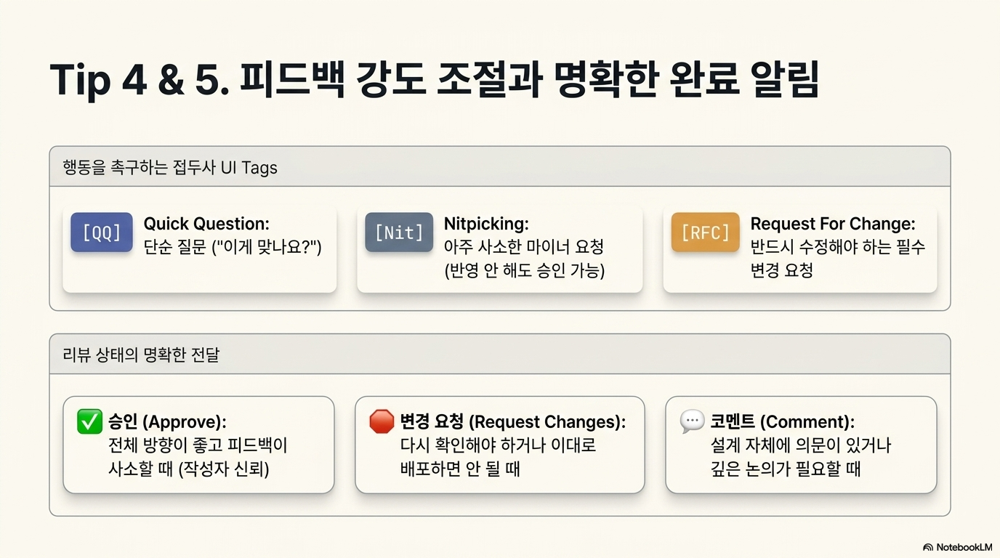
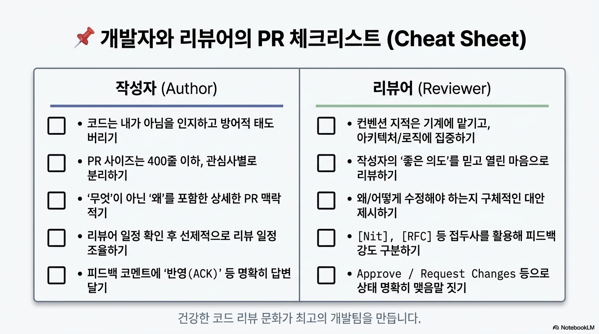
