# 배포과정

## 한눈에 보는 흐름

```text
Local 개발
  -> Pull Request
  -> CI 빌드/테스트
  -> Staging 배포
  -> 검증/승인
  -> Production 배포
  -> 모니터링/롤백 대응
```

## 문서 목적

- 이 페이지는 `개발/배포과정_image` 폴더의 PPTX를 슬라이드 이미지로 분리해 한 번에 확인할 수 있도록 정리한 문서입니다.
- 발표/복습 시 아래 이미지를 순서대로 스크롤해서 배포 과정을 빠르게 훑어볼 수 있습니다.

## 슬라이드 보기

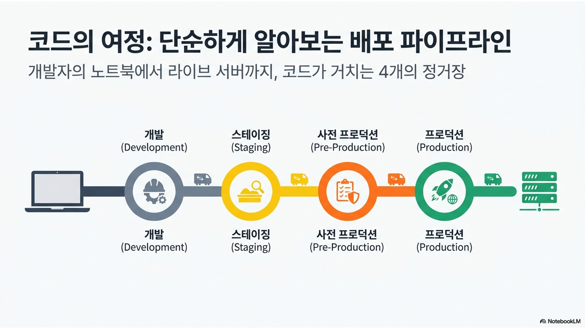
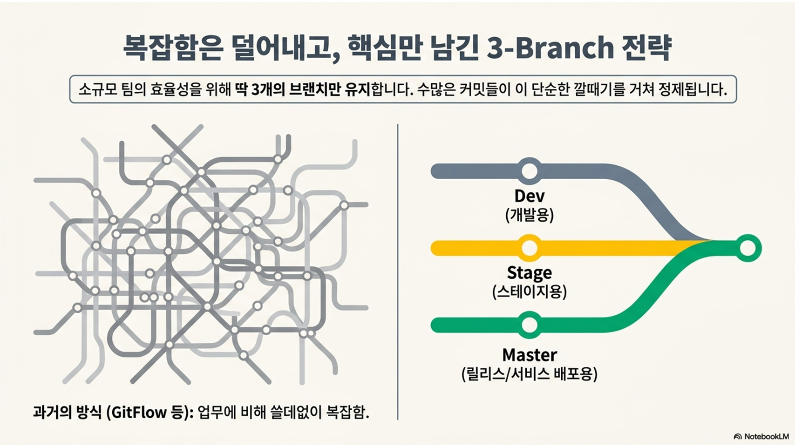
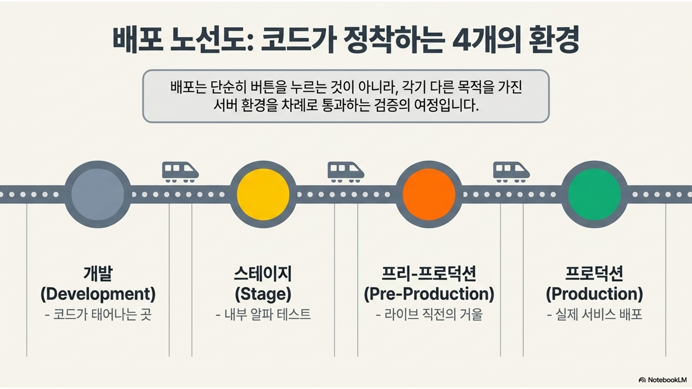
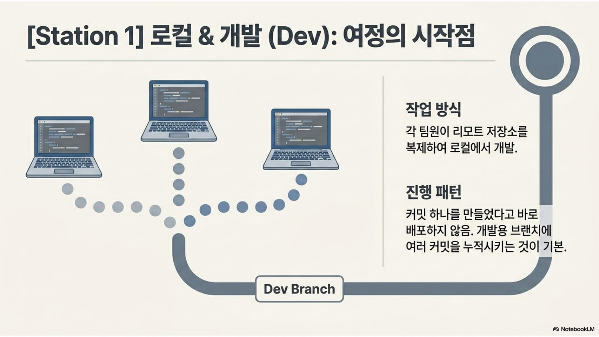
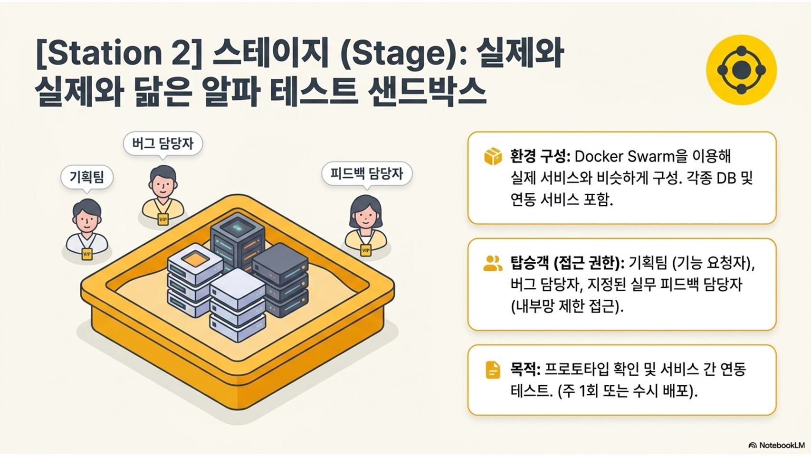
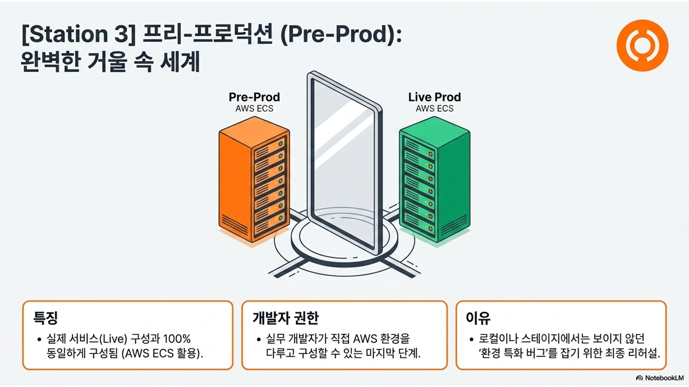
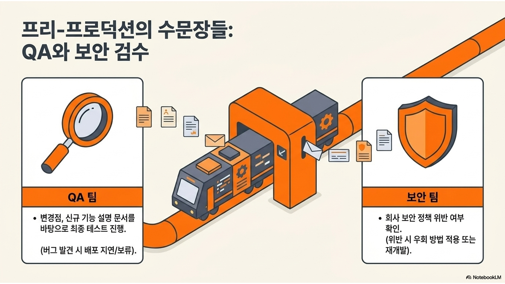
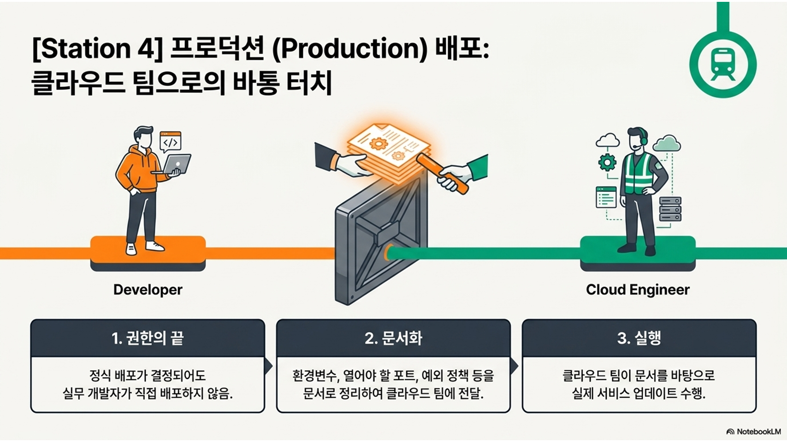
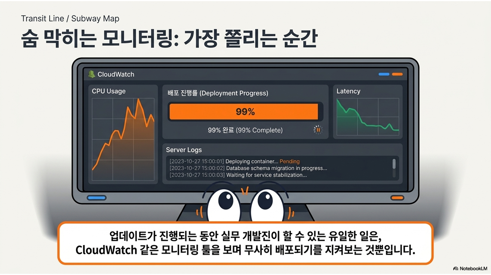
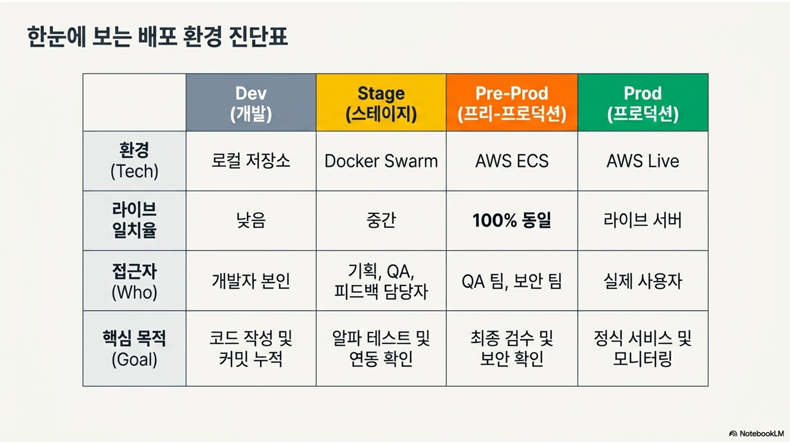
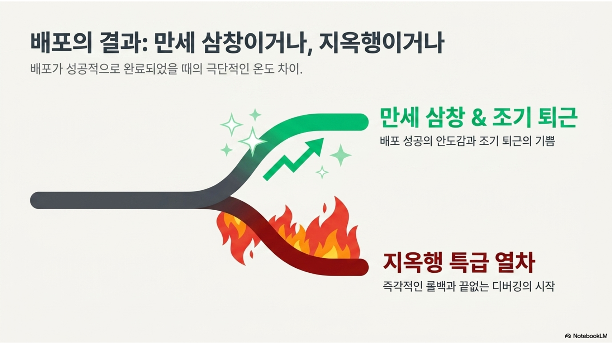
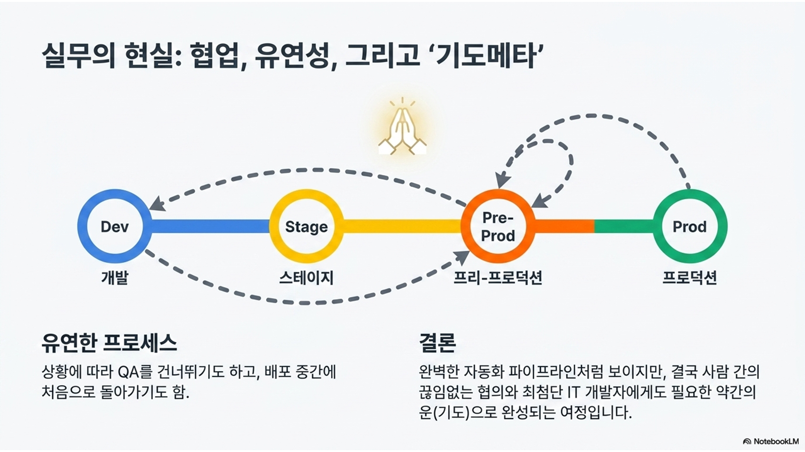
