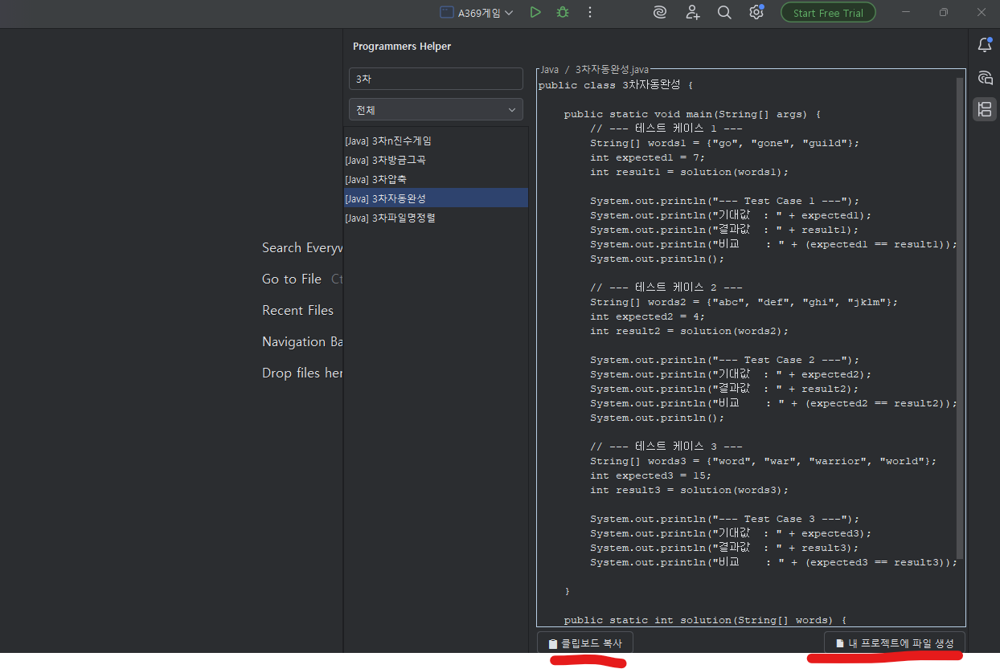
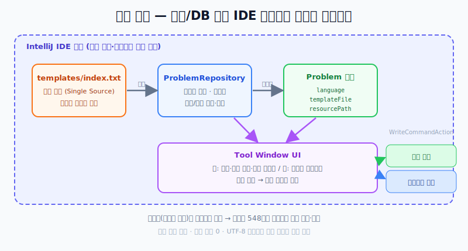

# Programmers Helper — 개발 포트폴리오

> **한 줄 소개**: 프로그래머스 문제 풀이의 "준비 시간"을 없앤 IntelliJ 로컬 생산성 플러그인.
> 문제 선택부터 실행 가능한 템플릿 확보까지를 **Tool Window 안에서** 끝낸다.

| 항목 | 내용 |
| --- | --- |
| 유형 | IntelliJ IDE 플러그인 (로컬 생산성 도구) |
| 기술 스택 | Kotlin, IntelliJ Platform SDK, Gradle |
| 배포 | JetBrains Marketplace |
| 핵심 컨셉 | **서버·DB 없이** IDE 내부에서 즉시 동작 |
| 규모 | Java 템플릿 548개를 데이터 기반으로 관리 |

## 실제 사용 화면

---

## 프로젝트를 시작한 이유

코딩테스트를 시작할 때마다 **문제 풀이보다 준비에 시간이 먼저 소모**되는 구조가 있었다.

- 문제별 파일 생성
- `solution` 시그니처 맞추기
- 테스트 케이스 복사/붙여넣기

이 반복 작업을 IDE 플러그인으로 흡수하는 것이 프로젝트의 출발점이었다.
핵심 목표는 명확했다 — **"풀이 전 준비 시간 제거".**

---

## 핵심 설계 결정 — 외부 서버 없이 IDE 내부에서

가장 중요한 결정은 **서버/DB 없이, IDE 내부에서 즉시 동작**하도록 만든 것이다.

| 결정 | 효과 |
| --- | --- |
| 서버/DB 없음 | 설치 후 바로 사용 가능 |
| 템플릿을 리소스 번들로 포함 | 네트워크 의존성 제거 |
| Tool Window 중심 UX | 코드 작성 화면(기본 작업 흐름) 유지 |

→ 운영 부담을 **0에 가깝게** 만들고, 배포 후 유지보수 난이도도 낮췄다.

---

## 구조와 구현

### 1. 데이터 기반 문제 목록 구성

- `templates/index.txt`를 **단일 소스**로 사용
- 앱 시작 시 인덱스를 읽어 문제 목록 생성
- 언어/제목 기준 정렬 및 필터링

코드상으로 `ProblemRepository`가 인덱스를 읽고 `Problem` 모델(`language`, `templateFile`, `resourcePath`)로 정규화한다.

### 2. Tool Window UI 흐름

- **좌측**: 검색 + 언어 필터 + 문제 리스트
- **우측**: 템플릿 미리보기
- **하단 액션**: 파일 생성 / 클립보드 복사

리스트에서 문제를 고르면 **즉시 템플릿을 로드해 프리뷰에 반영**한다.

### 3. IntelliJ 규약 기반 파일 생성

편의성보다 **안정성을 우선한** 생성 플로우를 유지했다.

- `WriteCommandAction`으로 쓰기 작업 래핑
- 이미 파일이 있으면 덮어쓰기 확인 다이얼로그 제공
- 생성 후 에디터 자동 오픈

---

## 기술적 문제와 해결

### 문제 1 — 템플릿 자산 규모 관리

Java 템플릿이 수백 개(현재 548개)라 **하드코딩이 불가능**했다.

**해결**
- 템플릿 파일명 목록을 **인덱스로 분리**
- 런타임에 인덱스를 파싱해 목록 구성
- 리소스 경로 규칙(`language/file`)으로 템플릿 로딩 단순화

### 문제 2 — 한글 파일명/콘텐츠 처리

문제명과 템플릿 파일명이 한글 기반이라 **인코딩 문제**가 발생하기 쉬웠다.

**해결**
- 텍스트 로딩/저장을 `UTF-8`로 고정
- 리소스 스트림 기반으로 운영체제 차이를 최소화

### 문제 3 — 끊김 없는 시작 경험

문제 선택 후 **곧바로** 코드 확인/생성이 가능해야 했다.

**해결**
- 리스트 선택 즉시 미리보기 갱신
- 프로젝트 루트를 초기 폴더로 제안
- "복사"와 "파일 생성" 두 경로를 모두 제공해 상황별 동선 최적화

---

## 배포와 운영 방식

- **Kotlin + IntelliJ Platform Gradle Plugin** 기반으로 패키징
- **JetBrains Marketplace** 배포 프로세스 구성
- 토큰을 **환경변수 또는 `.env`** 에서 읽도록 설정해 로컬/CI 환경 모두 대응

→ 배포 후 별도 서버 운영이 필요 없는 **플러그인형 제품**이다.

---

## 배운 점

- IDE 플러그인 개발에서는 기능 구현만큼 **IDE 규약 준수(Write Action, VFS, UI Thread)** 가 중요하다.
- **데이터(템플릿 목록)를 코드에서 분리**하면 확장성이 크게 좋아진다.
- 작은 생산성 도구라도 **사용자 흐름을 정확히 맞추면** 체감 가치가 즉시 발생한다.

## 다음 개선 계획

- Java 외 언어 템플릿 확장 (Kotlin/Python/JavaScript)
- 문제 메타데이터(난이도, 카테고리) 기반 필터 고도화
- 템플릿 업데이트 자동화 파이프라인 정비
