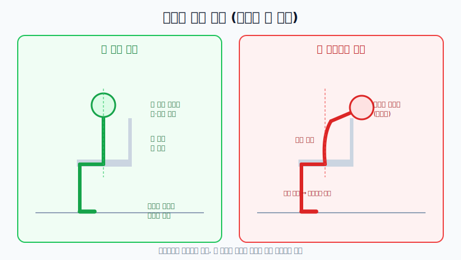

# 건강한 자세

## 바른 자세 vs 구부정한 자세

## 핵심 원칙

1. **올바른 앉기 자세 실천하기**
   두 발바닥을 바닥에 안정적으로 두고, 배를 당겨 등을 편 뒤 턱을 가볍게 당겨 정렬을 유지합니다.

2. **본인의 힘으로 자세 기억하기**
   보조 기구에 의존하지 않고 스스로 자세를 유지해, 척추와 골반의 정렬을 **몸이 기억하도록** 훈련합니다.

3. **신체 장기의 정렬과 기능 회복하기**
   구부정한 자세로 밀려난 장기 정렬을 바로잡아 소화 불량, 변비 등의 문제를 줄입니다.

## 실천 체크리스트

- [ ] 앉을 때 발바닥 전체가 바닥에 닿는지 확인
- [ ] 허리 과신전 없이 가슴-골반 정렬 유지
- [ ] 턱을 당기고 목을 길게 세운 상태 유지
- [ ] 30~60분마다 일어나 자세 리셋
