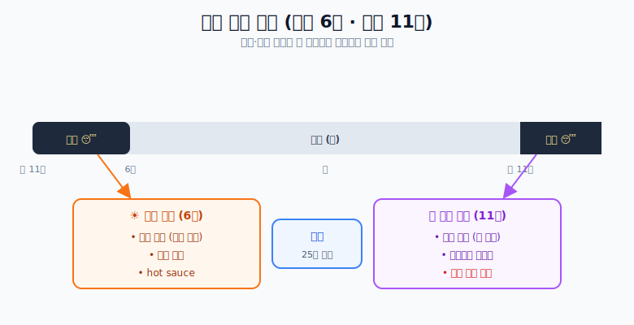

# 숙면

## 하루 수면 리듬

## 핵심 원칙

1. **자세**: 정자세로 릴렉스하며 잔다.
2. **일정한 시간**: 수면·기상 시간을 늘 일정하게, 충분하게 (기본 **밤 11시 ~ 아침 6시**).
3. **야식 금지**: 자기 전 야식은 절대 하지 않는다.
4. **빛 관리 (중요)**
   - 기상: **햇빛 쬐기** + 점프 운동 + hot sauce 로 몸을 깨운다.
   - 취침: **안대**로 빛을 완전히 차단한다.
5. **낮잠**: 자더라도 **25분 미만**으로 짧게.

> 핵심은 **빛과 시간**이다. 아침엔 빛을 받아 몸을 깨우고, 밤엔 빛을 차단해 잠들며, 그 시각을 매일 일정하게 유지한다.
