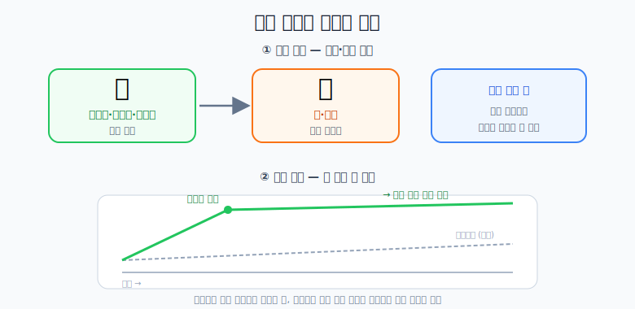

# 식사

## 먹는 순서와 개선 방식

## 핵심 원칙

1. **채소·과일 먼저**: 밥보다 **샐러드, 토마토, 바나나** 같은 것을 먼저 먹는다.
2. **밥은 줄이기**: 주식(밥)의 양 자체를 줄인다.
3. **한 번에 확 리셋**: 깨작깨작 조금씩 바꾸기보다, **한 번 제대로 된(엄격한) 생활**로 몸을 원상태로 돌려놓고,
   그다음 이전보다 조금 나은 생활을 이어간다. → 체감 개선이 훨씬 크다.
4. **식욕 억제 팁**
   - **이마 두드리기**가 의미 있다.
   - **시각적으로 배고픈 이미지(음식 사진 등)를 제거**한다.
