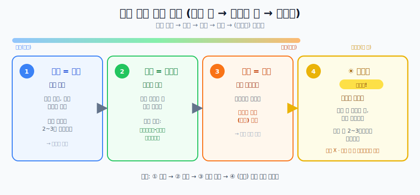

# 피부 관리 (건성 피부 기본)

## 용어부터 정리

같은 걸 다르게 부르는 경우가 많아 헷갈린다.

| 흔한 이름 | 같은 것 | 역할 |
| --- | --- | --- |
| **스킨** | 토너 (Toner) | 수분 공급 |
| **영양제** | 세럼 / 에센스 (Serum) | 고농축 영양 |
| **로션 / 크림** | 크림 (Cream) | 유분 보호막(잠금) |

> 로션과 크림은 사실상 같은 계열(유분 마무리)이고, 크림이 더 꾸덕하다.
> **건성 피부는 로션보다 꾸덕한 "크림"으로** 마무리하는 게 좋다.

## 순서 — 묽은 것 → 꾸덕한 것 → (아침) 선크림

바르는 순서는 항상 **묽은 것에서 꾸덕한 것으로** 가고, **아침에는 맨 마지막에 선크림**을 얹는다.

### 1단계. 토너(스킨) — 수분 공급 & 길 열기

- **언제**: 세안 직후, **물기가 마르기 전에 바로** 바른다.
- **팁**: 건성 피부는 손에 덜어 **찹찹 두드려** 흡수시키는 걸 **2~3번 반복(레이어링)** 하면 속당김이 크게 준다.

### 2단계. 세럼(영양제) — 고농축 영양 & 문제 해결

- **언제**: 토너가 스며든 후 적당량을 얼굴 전체에 펴 바른다.
- **팁**: 건성 피부라면 **세라마이드 · 판테놀 · 히알루론산** 같은 보습·장벽 성분이 든 **쫀쫀한 제형**을 고른다.

### 3단계. 크림(로션) — 유분 보호막 & 잠금장치

- **언제**: 스킨케어 **마지막 단계**에 바른다.
- **팁**: 젤처럼 투명하고 가벼운 수분크림보다, **연고·버터처럼 하얗고 꾸덕한 "보습(장벽) 크림"** 을 발라야
  낮 동안·밤새 수분이 날아가지 않고 유지된다.

### 4단계. 선크림 — 아침 스킨케어의 "가장 마지막"

- **언제**: 기초(토너→세럼→크림)가 다 흡수된 뒤, **아침 스킨케어의 맨 마지막**에 바른다.
  - 선크림은 "영양"이 아니라 **자외선 차단막**이라, 다른 제품 위에 **가장 바깥층**으로 올라가야 제 역할을 한다.
- **얼마나**: 생각보다 넉넉히. 야외 활동이 길면 **2~3시간마다 덧바른다.**
- **밤에는?** 밤엔 자외선이 없으니 **바르지 않는다.** 대신 낮에 바른 선크림은 **자기 전 클렌징으로 꼼꼼히 지워야** 한다. (안 지우면 모공·트러블 원인)
- **실내에서도?** 창가·장시간 화면 앞이라면 발라주는 게 좋다.

> 순서 정리
> - **아침**: 토너 → 세럼 → 크림 → **선크림**
> - **밤**: (클렌징 후) 토너 → 세럼 → 크림 *(선크림 X)*

## 하루 루틴 (얼굴 + 몸)

이게 **기본 골격**이고, 이것만 꾸준히 해도 충분하다.

| 시간 | 얼굴 | 몸 |
| --- | --- | --- |
| **아침** | 세안 → 토너 → 세럼 → 크림 → **선크림** | (샤워했다면) 바디로션 |
| **저녁** | 클렌징(선크림 지우기·이중 세안) → 토너 → 세럼 → 크림 | 샤워 후 바디로션 |

### 추가 팁

- **저녁 크림은 꾸덕하게**: 건성 피부는 밤에 로션으로만 마무리하면 밤새 당길 수 있다. **저녁만큼은 꾸덕한 크림**을 추천. (아침은 화장/가벼움을 원하면 로션도 OK)
- **오일**: 유독 건조할 때만 **가끔** 추가하면 된다.
- **나머지는 전부 옵션**: 팩, 각질 제거, 기능성 제품 등은 필수가 아니다. 위 루틴만 지켜도 상위권.

## 한 줄 요약

**수분 넣고(토너) → 영양 채우고(세럼) → 뚜껑 덮어 가두기(크림) → 아침엔 햇빛 우산 씌우기(선크림).**
건성일수록 크림은 꾸덕하게, 선크림은 아침 맨 마지막에.
