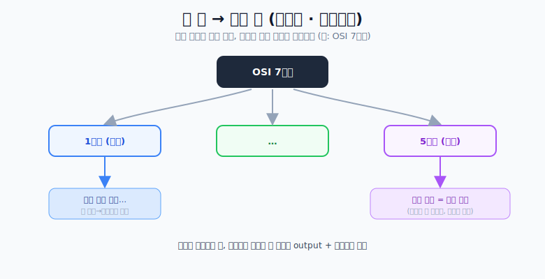

# 글을 읽는 법

## 1. 문해력 = 단어 + 내 방식의 이해

- **단어를 잘 알아야 한다.** 국어도 영단어 외우듯 단어를 외우고, 모르는 단어는 바로 검색한다.
- 한글 문장도 **내가 쪼개고 덧붙여 내 방식대로** 이해한다. (영어처럼 **주어·동사**를 찾는다.)
- 이해했으면 → **내 식대로 다시 설명**해 본다.
- 이때 **이미지화(손으로 그리든 어떤 방식이든)** 하면 좋다. 이미지화 대신 **구조화·도식화**도 좋다.

## 2. 이해한 것을 "기억"하기 — 큰 틀에서 작은 틀로

그냥 글을 통째로 암기하면 안 된다. 암기법도 글 읽는 법과 비슷하다.

1. **큰 틀 → 작은 틀로 도식화** (마인드맵 느낌)
   - 예) OSI 7계층 → 1·4·7계층으로 뼈대 잡기 → 각 계층 세부 내용 채우기
2. **키워드 중심 이해 후 암기**
   - 당연하게 외워지는 건 가볍게. 핵심 키워드 중심으로. (예: 세션 계층 = 세션 관리)
3. **글 읽기처럼 또 나눠서 이해** — 또다시 큰 틀에서 작은 틀로
4. **다 그렸으면 반드시 백지에 output + 설명**

> 보안기사 등 다른 공부에도 똑같이 적용해 본다. 핵심은 **뼈대 먼저 → 세부 → 백지 출력**.
