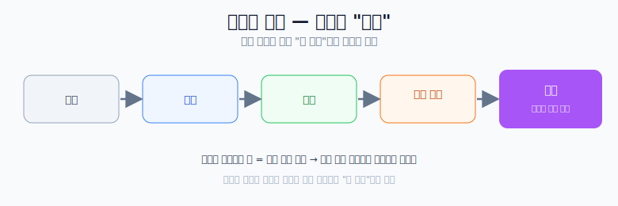

# 독해의 목적

## 독해 흐름

`발음 → 단어 → 문장 → 필자 의도 → 직관(나만의 쉬운 문장)`

## 예시
- 원문  
`포퍼는 지식을 수학적 지식이나 논리학 지식처럼 경험과 무관한 것과 과학적 지식처럼 경험에 의존하는 것으로 구분한다.`
- 직관 문장  
`수학/논리는 실험보다 논리 전개가 중심이고, 과학은 경험과 실험을 통해 검증한다.`

글을 쓰는것만으로 사고력 up.
문장을 완성 = 사고 정리 완

## 핵심 목표

- 독해의 최종 목표는 `직관(느낌)`을 얻는 것이다.
- 읽은 내용을 매번 `내 문장`으로 바꾸는 훈련을 한다.
- 독해뿐 아니라 유튜브 영상도 같은 방식으로 정리한다.

