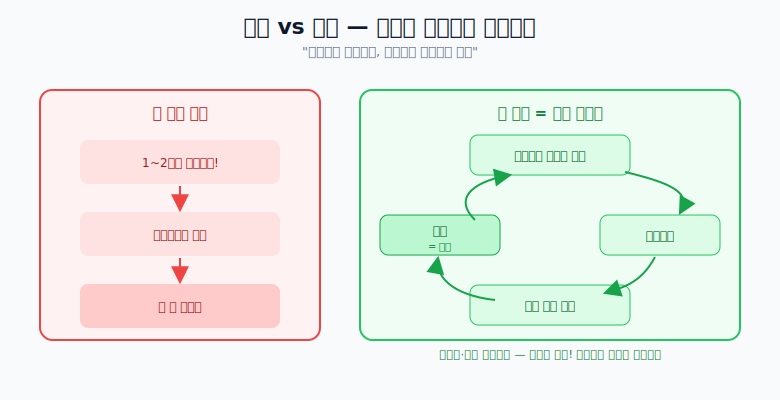

# 암기와 기억법

## 암기 vs 기억

> **상위권은 기억하고, 하위권은 암기하려 한다.**

억지로 암기하는 게 아니라, **이해하고 머릿속에 한 번 넣고 → 잊어버리고 → 다시 보고 이해하고 → 반복**하는 것이 기억이다.

## 실제 예시

- **등굣길**을 억지로 외운 적은 없다. 까먹고 다시 가보며 자연스럽게 익혔다.
- **노래 가사**도 억지로 다 외우지 않는다. 까먹고 또 듣고, 까먹고 또 듣는다.

## 핵심

- **1~2번 만에 완벽히 외우려 하면** 스트레스만 쌓이고 안 외워진다.
- **잊어도 좋다!** 반복해서 다시 공부하는 것이 오히려 기억으로 가는 길이다.
