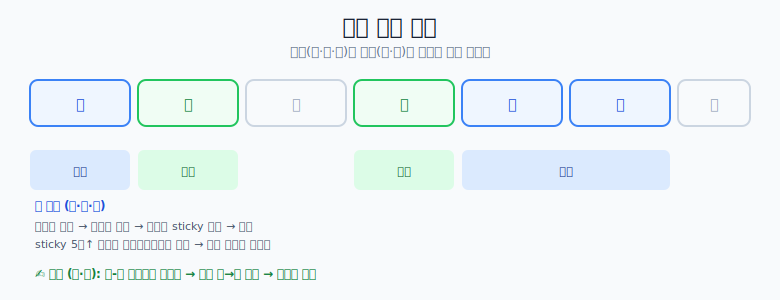

# 영어 공부

## 핵심 원칙 — 배우는 게 아니라 "익힌다"

- 영어는 **배우는 게 아니라 익히는 것**이다.
- **input(강의·듣기·책)과 output(말하기·쓰기)을 동시에** 한다.
- **혼자 말하기** 연습.
- 단어 수준이 아니라 **통문장으로**.
- **재밌어야 한다.** (내가 좋아하는 드라마·배우 등으로)

### 듣기 훈련

- 영상과 소리를 **같이** 듣는다 → 이후 **소리만 듣고 상황을 파악**하는 연습.
  (다른 언어도 가능. 단, 어느 정도 실력이 돼야 적용 가능)
- **영혼 독해**: 영어를 읽고 **내 식대로 이해**한다.
  - 내가 읽을 수 있을 만큼 **끊어서** → 점점 늘리면 긴 문장도 한 번에 이해 가능.

## 주간 루틴

### 회화 (월·금·토)

- **구슬쌤 채널** 강의 듣고 복습.
- 강의 듣는 법
  - **말하면서** 듣기
  - 필기는 **통문장으로** 적기 → **sticky 노트** → 반복
  - 강의 들으며 **상황극 연습** (이 표현을 내가 겪는 상황을 상상하며)
- 다음 강의 전 복습: sticky 노트 보며 **말로 뱉기** (노력 없이 볼 수 있게 붙여두기)
- sticky 노트가 **5일차 이상 쌓이면 스프레드시트로 이동** → 스프레드시트가 쌓이면 **강의 없이 복습만 하는 날**을 가진다.

### 번역 (화·목)

- **문어체** 익히는 데 좋다.
- 번역할 자료 고르기 (뉴스·책·유튜브 등 내 수준·흥미·도움에 맞는 것)
- **영-한 스크립트**를 구글 스프레드시트로 만든다.
  - *Language Learning with Netflix and YouTube (LLN)* 확장으로 유튜브 영-한 기계번역을 받을 수 있음.
- **내가 직접 번역** (한글 → 영어)
  - 타이핑이 힘드니 **voice in**(음성→텍스트) 확장으로, 영어로 말하면 그대로 스프레드시트에 입력.
- 내가 쓴 영어와 **원문 비교**.
- 복습이 필요한 건 따로 스프레드시트에 적기.

## 지속하는 법 (무료 툴 & 환경)

- **인증 앱**으로 공부 인증 (챌린저스, 파트타임 스터디, OMOT 커뮤니티 등)
- **영어 환경 만들기** (영어회화 앱 등)

> 참고 자료로 EBS 교재가 있으니 그걸 읽으며 정리한다.
