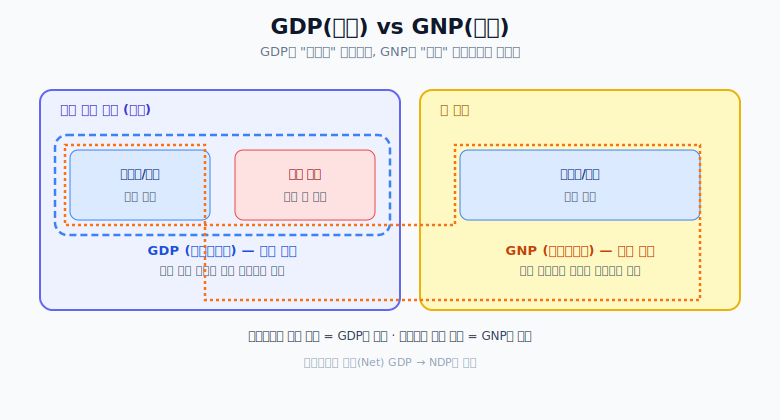

# NDP, GDP, GNP 정리

## 1) 생산과 부가가치(Product)

- 부가가치 개념:
  - 1,000원짜리 딸기로 3,000원짜리 딸기잼을 만들면,
  - 전체 3,000원이 아니라 새로 추가된 2,000원을 생산 가치로 본다.
- 부가세:
  - 이렇게 새로 더해진 가치(부가가치)에 부과되는 세금.

## 2) 총생산(Gross)과 순생산(Net)

- `GDP (Gross Domestic Product)`
  - 감가상각을 제외하지 않은 총생산 개념.
- `NDP (Net Domestic Product)`
  - 감가상각을 제외하고 순수하게 남는 생산 가치.

## 3) 국내(Domestic) vs 국민(National)

- `GDP (국내총생산)`:
  - 기준은 "영역(국내)".
  - 외국 기업이 한국에서 생산한 것은 포함.
  - 한국인이 해외에서 생산한 것은 제외.

- `GNP (국민총생산)`:
  - 기준은 "국적(국민)".
  - 한국 국적 개인/기업이 해외에서 생산한 것은 포함.
  - 외국 기업이 한국에서 생산한 것은 제외.

## 4) 결론 메모

한 국가의 발전 가능성이나 국민/기업의 실질 역량을 보려면  
GNP를 함께 보는 것이 적절하다는 관점이 있다.

## 한눈에 비교

| 지표 | 핵심 기준 | 감가상각 반영 |
| --- | --- | --- |
| GDP | 국내 생산(영역) | 미반영(Gross) |
| NDP | 국내 생산(영역) | 반영(Net) |
| GNP | 국민 생산(국적) | 지표 정의에 따라 별도 |
