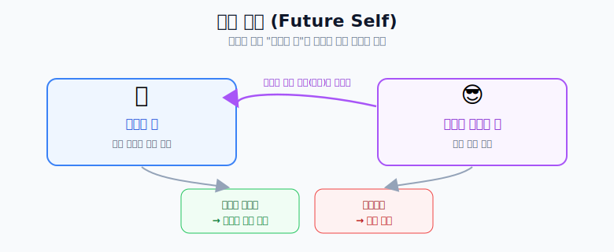

# 퓨처 셀프 요약

## 핵심

1. **바라는 미래의 나**를 상상한다.
2. 그 **미래의 내가 바라보는 과거** = 바로 **지금의 나**다.
3. 지금의 내 모습이
   - 그 상상과 **같다면** → 나는 원하는 미래의 내가 될 것이고,
   - **다르다면** → 원하는 미래의 내가 되지 못한다.

> 즉, "미래의 내가 지금의 나를 보면 뭐라고 할까?"를 기준 삼아 현재 행동을 점검한다.
