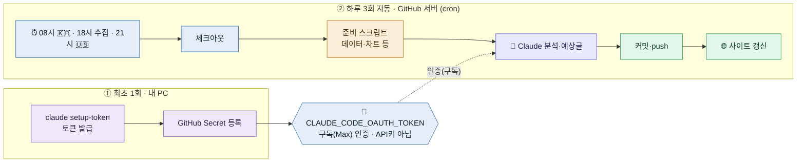
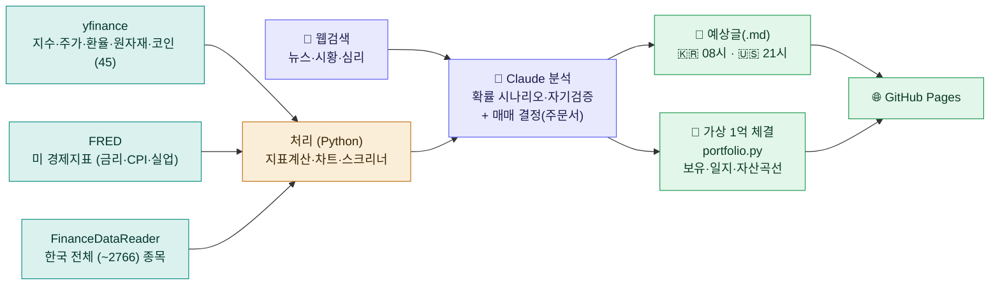

# 프로젝트 & 자동화 한눈에 보기

> GitHub 서버가 매일 데이터를 모으고 Claude가 분석해 공개 사이트에 올립니다.
> ① 어떤 자동화든 공통인 과정과 ② 이 프로젝트만의 데이터 흐름·기능을 정리합니다.
> (아래 다이어그램은 GitHub에서 보면 그림으로 렌더됩니다.)

---

## ① 자동화 공통 과정 — 무엇을 자동화하든 동일

주식이든 뉴스요약이든, **"정해진 시각에 → 데이터 준비 → Claude가 분석 → 결과 게시"** 는 똑같습니다.
인증은 내 **Max 구독 사용량**으로 처리됩니다 (API 토큰당 과금 ❌).

### 시행착오, 이렇게 다 반영했어요
헤매면서 고친 것들이 지금 코드에 들어가 있습니다.

| ✓ | 항목 | 내용 |
|---|---|---|
| ✅ | 파이썬 환경 | `tools` 폴더 설치 + 프로젝트별 `.venv` 격리 (전역 오염 없음) |
| ✅ | 한국 데이터 | pykrx는 KRX 로그인 요구로 실패 → `FinanceDataReader`로 대체 |
| ✅ | 클라우드 한글폰트 | 리눅스 서버에 `fonts-nanum` 설치 → 차트 한글 깨짐 해결 |
| ✅ | 견고한 스크립트 | 오류에 안 멈춤, `git pull --autostash`, 실행 로그 |
| ✅ | 과금 = 구독 | OAuth 토큰만 사용, **API 키 금지** → Max 사용량 차감 |
| ✅ | 토큰 함정 | 브라우저 "코드" ≠ 최종 "토큰". 코드를 터미널에 붙여넣어야 진짜 토큰 |
| ✅ | 안전장치 | AI가 무인 자율실행을 스스로 못 켬 → 사람이 직접 등록(정상) |
| ✅ | 날짜 정확성 | Jekyll 빌드 타임존 `Asia/Seoul` → 날짜 정상 표기 |
| ✅ | 지수 지연 함정 | yfinance 한국 지수가 하루 늦게 반영될 수 있음 → `data_date` 확인, 지연 시 대형주+뉴스로 대체 |
| ✅ | 체결 신뢰성 | 한국주 정수주수·시세기준일·체결환율 기록, 원본(data/·orders/) 커밋으로 검증 가능 |

> **내가 하는 건 딱 2번뿐:** ① `claude setup-token`으로 토큰 받기 → ② GitHub Secret에 등록.
> 나머지는 GitHub 서버가 매일 알아서 돌립니다. **이 과정은 어떤 자동화에도 그대로 재사용**돼요.
> (자세히: [CLOUD-AUTOMATION.md](CLOUD-AUTOMATION.md))

---

## ② 이 프로젝트의 데이터 흐름

하루 3회(08시 🇰🇷 예상 · 18시 한국장 마감 수집 · 21시 🇺🇸 예상), 여러 소스에서 **숫자**를 모으고(파이썬), **뉴스**는 Claude 웹검색으로 붙여 종합 분석 → **그날 장을 예측하는 글** + **가상 1억 매매**를 게시합니다.

### 어디서 무엇을 수집하나

| 소스 | 수집 내용 | 비고 |
|---|---|---|
| `yfinance` | 미·한 지수, 섹터 ETF, 주요주, 환율, 채권금리, VIX, 원자재, 암호화폐 — 약 45종목 | 글로벌·안정적 |
| `FRED` | 미 연방기금금리, 장·단기 금리 스프레드, 실업률, CPI(전년비) | 키 없이 CSV |
| `FinanceDataReader` | 한국 전체(~2766) 종목 스냅샷 → 비인기 후보 발굴 | 네이버/KRX |
| Claude 웹검색 | 뉴스·시황·이벤트·시장심리 | 여러 소스 교차 |

### 어떤 작업을 하나

| 단계 | 스크립트 | 내용 |
|---|---|---|
| 📥 데이터 수집 | `scripts/collect_data.py` | 45종목 시세 + 경제지표(FRED)를 JSON으로 |
| 📐 지표 계산 | (수집 시 포함) | RSI · MACD · 볼린저 · 이동평균(4종) · 모멘텀 · 추세배열 |
| 📈 차트 생성 | `scripts/make_charts.py` | 지수·주요주 차트 PNG (가격+이동평균+RSI) |
| 🔍 비인기종목 발굴 | `scripts/screener.py` | 과매도반등·거래량급증·낙폭과대·저점권반등 신호 |
| 🧑‍💼 Claude ①②③ 매니저 3인 (먼저) | `prompts/persona-*.md` + `portfolio.md` | 🛡️안정·🚀공격·🎯역발상 — 데이터 직접 보고 **성향대로 종목 매수/매도 확정** (독립 세션·계좌) |
| 🧠 Claude ④애널리스트 (뒤에) | `prompts/kr-report.md`·`prompts/us-report.md` | **3인 주문서 종합** → "오늘 이 종목 사라/팔아라" 종목 결론 리포트 + 어제 채점 |
| 💼 가상 매매 체결 | `scripts/portfolio.py <label> <persona>` | 성향별 1억 페이퍼 트레이딩 — 주문서 시가 체결(주식 정수주수·환율)·매매일지·자산곡선 |
| 🌐 자동 게시 | Jekyll → GitHub Pages | 예상글 + [/portfolio/](https://gks930620.github.io/stock-daily/portfolio/) 페이지 |

> **핵심 철학:** "예측 적중"이 아니라 **근거 있는 확률 + 자기검증**. 매일 예상을 기록하고 다음 날 실제와 대조해,
> 상승일 ≈53% 벤치마크를 넘는지 정직하게 관찰합니다. *(투자 조언 아님)*

---

- 하루 2회 자동 실행 · **장 마감 후**: 16시 🇰🇷(한국장 마감 후) · 06:30 🇺🇸(미국장 마감 후) (GitHub Actions) · 매매는 **당일 종가 체결**(개장 갭을 미리 먹음) · Claude 4명(①②③ 성향별 매니저 종목 확정 high → ④ 애널리스트 종합 리포트 xhigh) · 데이터 = 파이썬
- 공개 사이트: https://gks930620.github.io/stock-daily/ · [가상 포트폴리오](https://gks930620.github.io/stock-daily/portfolio/)
- 관련 문서: [RULES.md](RULES.md)(운영 규칙) · [DESIGN.md](DESIGN.md) · [CLOUD-AUTOMATION.md](CLOUD-AUTOMATION.md) · [AUTOMATION.md](AUTOMATION.md) · [TOOLING.md](TOOLING.md)

